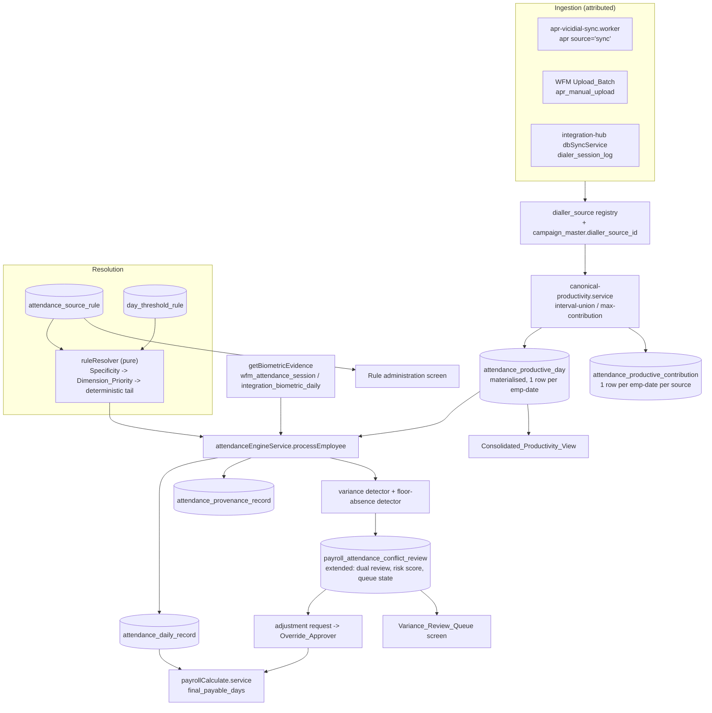

# Design Document

## Overview

This design replaces the two disagreeing attendance-source configuration stores with one
deterministically resolved rule store, moves the day-classification thresholds that currently ride
on `attendance_rule_config` into their own effective-dated store, registers every dialler as a
first-class source, closes the unattributed manual write path into `apr`, and defines one canonical
productive-minutes figure per employee per date that is materialised so payroll never recomputes it.

Everything here is anchored to code that exists today. The four load-bearing facts read from the
repository:

1. **Source resolution is an OR of two stores.** `attendanceEngineService.processEmployee()`
   (`backend/src/modules/wfm/attendance-engine.service.ts:735-747`) computes
   `isAprEmployee = configuredAprEmployee || hasScopedDiallerRule`, where `configuredAprEmployee`
   comes from `isAprEligible()` over `apr_eligibility_config` weighted process=4 / department=2 /
   designation=1, and `hasScopedDiallerRule` comes from `resolveRule()` over
   `attendance_rule_config` weighted designation=4 / process=2 / branch=1. Both queries end
   `ORDER BY specificity DESC LIMIT 1` with no tiebreak. Neither store can say "no" against the
   other, and neither is deterministic when two candidates tie.
2. **The engine then overwrites the resolved rule in memory.** Inside the APR branch the code does
   `rule = { ...rule, attendance_source: 'dialler', full_day_minutes: 480, half_day_minutes: 240 }`,
   and in the biometric branch `full_day_minutes: 540, half_day_minutes: halfDayFloor`. So
   `attendance_rule_config`'s own `full_day_minutes` / `half_day_minutes` are read by
   `classifyMinutes()` but that function is never reached on the `processEmployee()` path — the
   thresholds actually applied come from the hardcoded 540/480 constants in
   `classifyCosecMinutes()` / `classifyOperationsNetLogin()` plus
   `resolveHalfDayFloorMinutes()` over `attendance_feature_config`. The Day_Threshold_Rule store is
   therefore not only a relocation, it is the first time those columns will actually govern.
3. **Payroll reads a month-level sum, not a per-day figure.** `payrollCalculate.service.ts`
   Step 2 sums `attendance_daily_record.attendance_status` over the month into `paidBase`;
   Step 6 computes `finalPayableDays = Math.min(effectivePaidBase + finalWeekoffs + finalHolidays,
   activeCals)`; gross is `monthlyGrossBase * (finalPayableDays / daysInMonth)` and
   `lwpDeduction = 0` because absent days already reduce the numerator. Payroll never sees minutes.
   That is why the canonical figure must be materialised per employee-date on the write path and not
   computed inside a payroll query.
4. **`apr.Net_Login` is not an interval.** The sync worker
   (`backend/src/workers/apr-vicidial-sync.worker.ts`) computes
   `netLogin = wait_sec + talk_sec + dispo_sec + PAUSE_sec` and stores it as a TIME. It is a sum of
   activity buckets, not `Logout_Time - Login_Time`. Summing it across concurrent campaigns is what
   produces the 6,282.8-minute day in E11. The interval-union rule of Requirement 18.4 must be built
   from `Login_Time` / `Logout_Time`, and `Net_Login` becomes a per-source displayed metric and the
   contribution magnitude used by the secondary rule — never the aggregate.

Scope boundary held from the requirements: this design decides which feed builds salary days, how
productivity evidence is sourced and aggregated, and how a variance is reviewed. It does not change
how payable days convert into gross pay — `finalPayableDays` and the proration ratio are untouched.

## Architecture



The shape of the change: resolution becomes a pure function over a single store, productivity
aggregation becomes a materialised write-path concern, and everything downstream reads a stored
figure instead of re-deriving one. The engine keeps its existing entry point and its existing
`upsertDailyRecord()` write, so the nightly `processDateBatch()` sweep, the `is_locked` guard and
the manual-correction precedence all continue to work unchanged.

## Components and Interfaces

### 1. Single rule store and deterministic resolver

**Store.** New table `attendance_source_rule` (Data Models below). It carries the six
Rule_Dimensions, `attendance_source`, the effective-date window, `change_reason`, and a
`specificity_count` generated column. It does **not** carry `full_day_minutes`,
`half_day_minutes` or `grace_minutes` (criterion 1.14).

Set-valued dimension constraints (criterion 2.10, retained permanently by 15.7) are held in a child
table `attendance_source_rule_dimension_value` keyed `(rule_id, dimension, value_id)` rather than a
JSON column, so a dimension match is an `EXISTS` against an indexed row and the resolver stays a
single query. A dimension with zero child rows is unconstrained; one child row is the ordinary
single-value case; two or more is the duplicate-master-row case.

**Resolver.** `ruleResolver.resolve(employeeAttributes, date, ruleSet)` is a **pure function** over
an in-memory candidate set, not a `LIMIT 1` SQL query. This is the single most important structural
change: the two existing queries are non-deterministic precisely because they push tie-breaking into
`ORDER BY ... LIMIT 1`. The resolver instead:

1. Loads candidates with one query (active, date within window, every constrained dimension matching
   or having no constraint rows).
2. Filters to `max(specificity_count)`.
3. Walks `DIMENSION_PRIORITY_ORDER = ['cost_centre','process','branch','department','designation','employment_profile']`
   and at the first dimension constrained by *some but not all* survivors, keeps only those
   constraining it (criterion 2.4).
4. Falls to the deterministic tail: latest `effective_from`, then latest `created_at`, then lowest
   `id` in ascending byte order (criterion 2.5).
5. Returns `{ attendanceSource, decidingRuleId, candidates: [{ ruleId, eliminatedAtStep }],
   unresolvedDimensions: [...] }`.

A missing employee attribute makes every rule constraining that dimension a non-candidate and is
recorded in `unresolvedDimensions` (criterion 2.8) — it does not match by accident. Because the
System_Default_Rule constrains nothing it is always a candidate, so `resolve()` has no failure
return and the `id: 'fallback'` hardcoded escape hatch in today's `resolveRule()` is deleted rather
than ported.

The same pure walk is reused for the Day_Threshold_Rule store and for the three threshold
configurations (APR_Corroboration_Threshold, Variance_Tolerance, Floor_Absence_Pattern_Ceiling), so
"resolved by the same candidacy and tie-breaking rules as Requirement 2" is one implementation, not
four.

**Resolution preview** (criteria 2.9, 12.4) is the same function called with `explain: true`; the
route returns the candidate list with elimination steps. It is a read, so it needs no separate
engine path.

**Replacing the OR-combination.** `processEmployee()` loses `isAprEligible()`,
`hasScopedDiallerRule`, `isOperationsExecutiveByRegex()` and the
`isOperationsDepartmentName()` production-safe fallback that currently promotes an employee to
dialler on the strength of `diallerMinutes >= 240`. In their place:

```ts
const resolved = await sourceRuleResolver.resolve(empAttrs, date);
const thresholds = await dayThresholdResolver.resolve(empAttrs, date);
const source = resolved.attendanceSource;           // 'biometric' | 'dialler'
```

`isEnrolledInAprFeed()` survives but changes meaning: it no longer decides *whether* an employee is
judged on dialler, only whether a dialler-resolved employee with no record is an absence or a
review item (criterion 4.7), and it queries the registered Productivity_Feeds through the canonical
layer rather than `apr` directly.

### 2. Day_Threshold_Rule store

`day_threshold_rule` mirrors `attendance_source_rule`'s dimension shape and carries
`full_day_minutes`, `half_day_minutes`, `grace_minutes`. One unconstrained row is mandatory
(criterion 1.15).

`classifyMinutes(rawMinutes, thresholds)` becomes the only classifier. `classifyCosecMinutes()` and
`classifyOperationsNetLogin()` are reduced to thin wrappers that take resolved thresholds, keeping
their existing signatures for the six other call sites that use them
(`attendance-apr-bulk.routes.ts`, `payroll-attendance-control.service.ts` and the reconciliation
services) until those are migrated, then deleted. `resolveHalfDayFloorMinutes()`'s malformed-value
guard moves onto the new store's validation: a non-finite or non-positive threshold is rejected at
write time rather than defended at read time.

`attendance_feature_config.biometric_half_day_floor_minutes = 270` and
`netlogin_half_day_floor_minutes = 240` seed the unconstrained row (criterion 15.8). Note the
consequence and why criterion 15.9 exists: the biometric half-day floor actually applied today is
`resolveHalfDayFloorMinutes('biometric_half_day_floor_minutes')` = 270, while the 28
designation-scoped `attendance_rule_config` rows carry 240 in their unused `half_day_minutes`
column. Migrating those columns verbatim would move the half-day boundary for 977 Operations
Executives. The reconciliation of 15.9 must therefore be produced from what the engine *applies*,
not from what the rows *say*.

### 3. Dialler_Source registry

New table `dialler_source`. Resolution of an ingested row to a registry row, per criterion 16.4:

| Feed | Key | Resolution |
| --- | --- | --- |
| `dialer_session_log` | `dialer_name` (NULL on all 1,365 rows) then `integration_key` | `dialler_source.integration_key = 'dialer_1'` seeds the single ViciDial row; ingestion writes `dialer_name` = the registry identifier from then on (criterion 16.6) |
| `apr` source=`sync` | `campaign_id` | `campaign_master.campaign_code` -> `campaign_master.dialler_source_id` |
| `apr_manual_upload` | `campaign_id` + `Upload_Batch.dialler_source_id` | Upload_Batch is authoritative; `campaign_id` must still resolve |

`campaign_master` exists (`backend/sql/015_platform_foundation.sql`) with `campaign_code`,
`campaign_name`, `process_id`, `lob_id` and holds 0 rows. It gains `dialler_source_id` and an
`owning_branch_id`. The 78 free-text `apr.campaign_id` values are seeded as `campaign_code` rows;
those whose owner cannot be determined are seeded `active_status = 0` and listed (criterion 15.19),
which makes them fail criterion 16.5 loudly instead of contributing anonymously.

`'MANUAL_UPLOAD'` is rejected as a Dialler_Source identifier by a `CHECK`-equivalent validation in
the registry service plus a seeded `campaign_master` row marked `is_sentinel = 1` that the
canonical aggregator excludes (criterion 16.8).

**Metric_Availability** is a JSON array on `dialler_source` validated against a controlled metric
list constant (`PRODUCTIVITY_METRICS`), holding the E14 vocabulary: `calls`, `wait_time`,
`talk_time`, `dispo_time`, `pause_time`, `aht`, `login_time`, `logout_time`, `net_login`, `bio`,
`lunch`, `qa`, `dismx`, `training`. An `integrated_pull` `apr` source declares all fourteen; a
`manual_upload` source declares `calls`, `aht`, `net_login`, `bio`, `lunch`, `qa`, `training` only.
`dialer_session_log` declares `net_login` alone.

**Column_Mapping** (criteria 16.12–16.14). Every `manual_upload` Dialler_Source carries a
`dialler_source_column_mapping` row, its `column_mappings` a JSON object of
`{ "<source header>": "<target_field>" }` pairs, so the upload pipeline parses whatever column
layout that branch's vendor report actually uses instead of a hardcoded template. This mirrors
`wfm_header_mapping_profile.column_mappings` (migration 1500,
`backend/src/modules/wfm/header-mapping-profile.service.ts`) — an existing, working JSON-mapping
pattern for a different bulk upload (roster import) in this same module — rather than a normalized
row-per-pair table, so the new pipeline follows an established convention instead of introducing a
second shape for the same idea. Unlike `wfm_header_mapping_profile`, this table carries no
`FOREIGN KEY` to `process_master` — migration 1500's FK is the one that has been blocking every
deploy since 2026-08 (repo memory: "Migration 1500 blocks all deploys"), so `dialler_source_id`
here is a plain indexed `CHAR(36)`, matching the no-FK convention every other new table in this
design already follows. `target_field` is constrained to the same field set `apr_manual_upload`
already exposes (employee code, report date, login minutes, calls handled, AHT seconds, bio/lunch/
QA/training minutes) plus `login_time` and `logout_time` where a source's file can supply them —
criterion 16.13's whole purpose is letting a source that genuinely has ordered timestamps feed the
interval-union primary rule of Requirement 18 instead of being permanently confined to
max-contribution for want of a mapping. This is a mapping-time decision per Dialler_Source, made
once by a Rule_Administrator (criterion 16.12), not a per-file wizard the uploader runs each time —
it is what keeps the "register once, then it's smooth" property this design already relies on for
Dialler_Source and campaign registration, rather than reopening the free-text-anything path this
feature exists to close. A mapping is versioned (`mapping_version`, `effective_from`): amending it
governs only submissions from that point forward, and each already-accepted
`attendance_productive_contribution` row retains the mapping version it was parsed under (criterion
16.14), the same pattern `derivation_version` already uses for the aggregation rule.

### 4. WFM manual upload pipeline

New route module `backend/src/modules/wfm/productivity-upload.routes.ts`, modelled on
`attendance-apr-bulk.routes.ts` (multer CSV, `MAX_UPLOAD_MB`, the explicit multer rejection handler
that keeps a bad file type out of the global error handler's masking branch, chunked multi-row
inserts with catch-per-chunk).

**Upload_Batch identity.** New table `productivity_upload_batch`: `id`, `batch_reference`,
`dialler_source_id`, `branch_id`, `process_id`, `date_from`, `date_to`, `file_name`,
`content_digest` (SHA-256 of the uploaded bytes), `uploaded_by`, `submitted_at`,
`submitted_row_count`, `accepted_row_count`, `rejected_row_count`, `supersedes_batch_id`,
`superseded_by_batch_id`, `status`. Rejection reasons go to
`productivity_upload_rejection (batch_id, row_number, employee_code, reason)` so criterion 17.2's
"a reason for each rejection" is a row, not a truncated blob.

**Parsing.** The route loads the submitting Dialler_Source's active Column_Mapping first, before
touching the uploaded file's rows. If the file's header row does not contain every mandatory
`target_field` the mapping requires (employee code, report date, login minutes), the whole batch is
rejected before any row is processed and every unmatched or missing header is named (criterion
17.15) — this is the same fail-fast-before-any-row-lands posture the multer rejection already uses,
just one check earlier. A matched header set is then used to build a column-index dictionary so the
row parser reads by mapped field name, not by fixed position — a vendor's reordered or renamed
columns do not require a code change once the Dialler_Source's mapping covers them.

**Preview** (criterion 17.14). Before the batch commits, the route returns at least the first ten
rows as parsed under the mapping, so the WFM_Uploader confirms the mapping actually produced sane
values (an employee code column mapped to the wrong header reads as plausible-looking garbage, not
an error, until someone looks) before any row is written. Confirmation is a second call against the
same pending-batch identifier; the batch is not accepted on the first request.

**Validation order** (fail fast, one reason per row, run after preview confirmation): required
fields (employee code, report date, login minutes) -> employee code resolves in `employees`
(criterion 17.5; 56 of 727 `apr.UserID` values do not) -> date inside the batch's declared range ->
branch inside the uploader's resolved scope via `resolveUserBusinessScope` (criterion 17.8) -> not a
duplicate against a non-superseded prior batch for the same (dialler_source, employee, date)
(criterion 17.6).

**Supersession.** A re-upload sets `supersedes_batch_id`; the prior batch's rows are stamped
`superseded_by_batch_id` and `superseded_at`. The canonical aggregator's contribution query filters
`superseded_at IS NULL`, so exclusion is a predicate rather than a delete, satisfying 17.7 and
17.12 together.

**Closing the unattributed write path.** Phase 3 of `attendance-apr-bulk.routes.ts` — the
`INSERT INTO apr (... campaign_id ...) VALUES (..., MANUAL_UPLOAD_CAMPAIGN, ...)` block that
produced all 3,810 rows — is replaced by a write to `apr_manual_upload` carrying
`upload_batch_id`. Because that route also writes `attendance_daily_record` with `is_locked = 1`
and that behaviour is load-bearing (its own header records the incident where the nightly sweep
silently erased an upload), the attendance write is kept; only the evidence write moves. A
`BEFORE INSERT` trigger on `apr` rejects any row with `source = 'manual'` and
`upload_batch_id IS NULL`, following the migration-1213 immutability-trigger precedent — the
application guard alone would not stop an ad hoc script, and the whole point of criteria 15.18 and
17.10 is that the path is closed rather than merely unused.

### 5. Canonical daily aggregation

New service `backend/src/modules/wfm/canonical-productivity.service.ts`. The derivation is a **pure
function** over a contribution list so it is directly property-testable:

```ts
type Contribution = {
  diallerSourceId: string;
  interval: { startMinute: number; endMinute: number } | null; // minutes from 00:00 on the target date
  magnitudeMinutes: number;                                    // Net_Login / login_minutes
  exclusionReason?: string;
};

deriveCanonical(contributions: Contribution[]):
  { minutes: number | null; rule: 'interval_union' | 'max_contribution'; excluded: [...] }
```

- **Primary rule (18.4).** Every contribution has a usable interval -> sort by start, sweep-merge
  overlaps, sum merged lengths. Any instant covered twice counts once.
- **Usable interval (18.5).** Both `Login_Time` and `Logout_Time` present and
  `Logout_Time > Login_Time`. Anything else records an `exclusionReason`.
- **Secondary rule (18.6).** If *any* contribution lacks a usable interval, the whole employee-date
  falls to `max(magnitudeMinutes)` and records `rule = 'max_contribution'`. Not configurable.
- **Absent, not zero (18.10).** Empty contribution list returns `minutes: null`.
- **Bound (18.2, 18.11).** `Math.min(minutes, 1440)`.
- **Midnight apportionment (18.8).** A session with `Logout_Time < Login_Time` is a cross-midnight
  session, not a malformed one: it is split into `[start, 1440)` on the session date and
  `[0, end)` on the next date, and each part is offered to that date's derivation. This runs before
  the usable-interval test, so a night shift does not silently demote a whole date to the secondary
  rule. `buildShiftWindowInfo()` / `isCrossMidnightShift()` already encode this two-date window in
  the engine and are reused.

**Which rule will actually govern.** `dialer_session_log` carries `login_minutes` only — no login
or logout column (`backend/sql/009_dialer_ispark.sql`). `apr_manual_upload` carries `login_minutes`
only. So the secondary rule fires on every employee-date touched by either feed. In July 2026
`dialer_session_log.session_date` decided 7,366 `attendance_daily_record` rows against 5,186 for
`apr.ReportDate` (E6), which means max-contribution — not interval-union — will be the effective
rule on the majority of dialler days at release. This is a correct application of the settled
decision, and criterion 18.7 makes it visible per employee-date, but it is a material fact for
whoever reads the figures. It is carried into Risks below.

**Materialisation.** `attendance_productive_day` holds one row per `(employee_id, work_date)` with
`canonical_minutes`, `producing_rule`, `contribution_count`, `derived_at`, `derivation_version`.
`attendance_productive_contribution` holds one row per `(employee_id, work_date,
dialler_source_id, feed, source_row_ref)` with the interval, magnitude, exclusion reason and the
per-metric values the Consolidated_Productivity_View needs. Both are written by the aggregator, and
the aggregator is invoked from three places: the vicidial sync worker after its upsert, Upload_Batch
acceptance, and `dbSyncService` after a `dialer_session_log` write. `processEmployee()` **reads**
`attendance_productive_day`; it never derives.

`derivation_version` implements criterion 18.15: a release that changes the derivation bumps the
constant, the reprocessing lister selects rows whose stored version is behind, and any date in a
Pay_Month past cut-off is refused rather than recomputed.

### 6. Corroboration and variance detection

Both read `attendance_productive_day`, never `attendance_daily_record.dialler_minutes`
(criteria 5.1, 10.2).

**Absent-versus-zero at the data-access boundary** (criteria 5.2, 5.3, 18.10). This is enforced by
type, not by convention. A single accessor is the only permitted read:

```ts
type ProductivityEvidence =
  | { state: 'present'; minutes: number; rule: 'interval_union' | 'max_contribution' }
  | { state: 'absent' };

getProductivityEvidence(employeeId, date): Promise<ProductivityEvidence>
```

There is no `number | null` shape anywhere above this accessor, so `0` cannot be read as a
measurement: an absent row returns `{ state: 'absent' }` and every caller must destructure the
discriminant before reaching a number. `attendance_daily_record.dialler_minutes` continues to be
written for backward compatibility with the existing reports and the control tower, and a lint-level
contract test asserts that no file under `modules/wfm` or `modules/payroll` reads it for a
corroboration or detection decision — the same style of source-asserting contract test already used
in `aprBulkEvidence.contract.test.ts`.

**Variance detection** runs inside `processEmployee()` after classification, so it sees the resolved
source, both minute figures and the applied thresholds in one place, and writes a Variance_Record
through the review-queue service. Criterion 6.5's idempotence is an upsert on
`(employee_id, issue_date, issue_type)` against the existing `conflict_key` unique key.

`Variance_Risk_Score = Biometric_Minutes - Canonical_Productive_Minutes`, stored on the record so
ranking is a sort on an indexed column rather than a computed expression.

**Resolved source with no data at all** (criterion 4.6). This is distinct from ordinary
corroboration: it fires when the *resolved* source has no evidence for the date — no biometric
punches at all where biometric is resolved, or `ProductivityEvidence` is `absent` where dialler is
resolved — while the *other*, non-resolved feed does report minutes for that date. Ordinary
Variance_Records (6.1, 6.4) compare two present figures; this case has nothing from the resolved
source to compare against, so it is not routed through `assignQueueState()`. Instead
`processEmployee()` sets `attendance_status = 'unreconciled'` (the existing enum value already
reserved for this kind of ambiguity), records both feeds' minutes on the
`attendance_provenance_record` (both fields already exist there regardless of scenario), applies
`lwp_value = 0` rather than an absence penalty, and raises a Variance_Record with
`issue_type = 'resolved_source_no_data'` so it still reaches the same Dual_Review queue and carries
the same reviewer/adjustment machinery as every other variance, rather than needing a second review
surface. It is always queued, the same as a Floor_Absence_Pattern occurrence, because there is no
risk score to rank it by.

### 7. Floor_Absence_Pattern detection

Reads the same `ProductivityEvidence` accessor. Fires only when evidence is `present` and below the
resolved Floor_Absence_Pattern_Ceiling while Biometric_Minutes reach the resolved
`full_day_minutes` (criteria 10.1, 10.11). The two-punch variant (10.5) reads
`attendance_daily_record.clock_in_time` / `clock_out_time` (added by
`backend/sql/070_attendance_clock_columns.sql`) and the raw `biometric_attendance_log` first/last
punch, matching the fallback chain `calculateLateArrival()` already uses.

**Always-queue.** The queue-state assignment is deliberately *not* part of detection. Detection
writes `is_floor_absence = 1` on the Variance_Record; a separate per-branch per-Pay_Month
`assignQueueState(branchId, payMonth, ceiling)` pass sets every `is_floor_absence = 1` record to
`queued` unconditionally, ranks the remainder by `variance_risk_score DESC`, queues up to the
ceiling and sets the rest `recorded_not_queued`. Keeping this as one idempotent pass rather than a
per-row decision is what makes criteria 6.13 (no-discard) and 6.14 (ranking monotonicity) provable:
they are invariants of a single function over the whole branch-month set.

**Repeat-offender escalation** (10.7, 10.8): a rolling-window count over
`attendance_floor_absence_occurrence`, defaulting to three occurrences in 30 days, notifying the
branch head and WFM head through `inboxService.createItem()` — the same non-blocking, dedupe-by-
`action_url` pattern `checkAndNotifyBiometricMismatch()` uses today.

**Ceiling resolution** (criteria 6.10, 12.7). `assignQueueState(branchId, payMonth, ceiling)`'s
`ceiling` argument is resolved, not hardcoded: look up `attendance_dual_review_ceiling` for
`(branchId, payMonth)` exact match, then `(branchId, NULL)`, then `(NULL, payMonth)`, then apply
100 if no row matches — the same most-specific-first precedence used elsewhere in this design,
just over two dimensions instead of six, because Dual_Review_Ceiling is scoped to branch and
Pay_Month rather than to the Rule_Dimensions. The rule administration screen's ceiling
configuration (12.7) writes this table.

### 8. Dual_Review as an extension of `payroll_attendance_conflict_review`

The existing table (268 rows, created lazily by `ensureReviewTable()` in
`payroll-attendance-control.service.ts` and registered as
`backend/sql/537_payroll_attendance_conflict_review.sql`) is extended, not replaced, because the
control tower already reads it through `attachReviewState()` and the
`/payroll/attendance-control-tower` surface is live.

Added columns:

| Column | Purpose |
| --- | --- |
| `wfm_reviewer_user_id`, `wfm_reviewed_at`, `wfm_outcome`, `wfm_comment` | first reviewer slot |
| `manager_reviewer_user_id`, `manager_reviewed_at`, `manager_outcome`, `manager_comment` | second reviewer slot |
| `manager_substituted_for_user_id` | criterion 7.6's branch-WFM substitution for the 1 employee with no `reporting_manager_id` |
| `queue_state` `enum('queued','recorded_not_queued')` | criteria 6.9, 6.11 |
| `variance_risk_score` INT | ranking |
| `is_floor_absence` TINYINT | always-queue |
| `contested` TINYINT, `contested_at`, `override_approver_user_id` | criterion 7.10 |
| `presented_at`, `escalation_age_days`, `escalation_interval_days`, `last_escalated_at` | SLA (7.8, 7.9) |
| `biometric_minutes`, `canonical_productive_minutes`, `applied_corroboration_threshold`, `applied_variance_tolerance`, `resolved_attendance_source`, `deciding_rule_id` | the evidence snapshot criterion 6.3 requires, on the record rather than re-derived |
| `pay_month`, `carried_forward_from_pay_month` | criteria 9.3, 13.2 |

The existing `status` enum is kept and mapped rather than widened: `open`/`notified` stay as
presentation state, `reviewed` is set only when both slots hold an outcome (criterion 7.5). The
`Review_Outcome` vocabulary lives in the two new `*_outcome` columns as
`enum('apr_accepted','apr_disputed','adjustment_requested')`, which is why 7.11 asks for a new
vocabulary rather than a reuse of `no_issue` / `regularization_required`.

Migration of existing contents (criterion 7.12): the 209 `dialler_missing_adr` rows already
`reviewed` are closed without migration — they record a missing-ADR repair, not a productivity
variance, and the repair path (`repairMissingAdrFromApr`) still owns them. The 39
`biometric_penalty_dialler_supports_better` and 20 `dialler_penalty_biometric_supports_better` rows
at `notified` map to Variance_Records with `queue_state = 'queued'`, `wfm_outcome = NULL`, and
`presented_at` set from `created_at` so their SLA clock is honest rather than reset.

`PATCH /api/wfm/mismatches/:id/resolve` in `mismatch-review.routes.ts` currently rewrites
`attendance_status` and `lwp_value` directly. That is exactly the authority criterion 8.1 removes.
The route is kept for the `missing_punch` / `week_off_worked` items it also serves, but a
Variance_Record reaching it is refused with a pointer to the review queue; recording an outcome and
requesting an adjustment become separate endpoints on a new
`backend/src/modules/wfm/variance-review.routes.ts`.

### 9. Adjustment authority and segregation of duties

`salary_prep_line_adjustment` exists with 0 rows (E9) and is the natural home for an approved
adjustment's payroll effect. The request itself lives on a new
`attendance_adjustment_request`: `variance_record_id`, `employee_id`, `target_date`,
`requested_status`, `requested_lwp_value`, `requesting_user_id`, `justification`,
`approval_state`, `approver_user_id`, `approved_at`, `superseded_classification`,
`superseded_lwp_value`, `arrear_pay_month`.

Three refusals, all recorded via `logSensitiveAction()` before the 4xx:

1. Approver lacks the Override_Approver grant for the employee's branch (8.4, 14.3).
2. Requesting user equals approving user (8.5).
3. **Rule-author-cannot-approve** (14.5): the approver is refused if
   `attendance_source_rule_audit` holds a create or amend entry by that same user for the
   `deciding_rule_id` stored on the Variance_Record. This is a query against the audit log rather
   than against `attendance_source_rule.created_by`, because an amender who did not create the row
   is equally conflicted and `created_by` cannot see them.

Cut-off is resolved with the predicate already established in
`wfm.regularization.secure.routes.ts`: a Pay_Month is past cut-off when a `salary_prep_run` for
that `run_month` (VARCHAR `'YYYY-MM'`, matched as a string) has
`attendance_snapshot_locked = 1` or `LOWER(status) IN ('finalized','locked','disbursed','approved')`.
That comment records that `attendance_snapshot_locked` is 0 on every production row while 51 of 67
runs are FINALIZED, so status is the clause that actually carries it — reusing the helper rather
than writing a fresh one is what keeps criteria 3.2, 8.6 and 17.9 agreeing with the rest of the
platform.

### 10. Provenance and the immutable audit log

`attendance_provenance_record`, one row per employee-date processed, carrying the resolved source,
`deciding_rule_id`, `deciding_day_threshold_rule_id`, both minute figures, the producing aggregation
rule, the applied thresholds, the resulting classification and `processed_at`. Written by
`upsertDailyRecord()` in the same call so criterion 11.6's completeness property is structurally
true rather than eventually true. The per-Dialler_Source breakdown is not duplicated here — it is
`attendance_productive_contribution`, referenced by `(employee_id, work_date)`, which is what makes
criterion 11.7's aggregation-traceability property checkable against the same rows the aggregator
wrote.

`attendance_source_rule_audit` is the Rule_Audit_Log: acting user, timestamp, action, prior JSON,
new JSON, change reason, covering Attendance_Source_Rules, Dialler_Source registrations and
Upload_Batches. Criterion 11.3's "reject any request to modify or delete" is enforced by
`BEFORE UPDATE` and `BEFORE DELETE` triggers that `SIGNAL SQLSTATE '45000'`, the migration-1213
pattern — application-level append-only would not survive an ad hoc script, and an audit log that
can be quietly rewritten is not one. Review outcomes, adjustment actions and Upload_Batch
submissions additionally go through `logSensitiveAction()` into `sensitive_action_log`, which is
where the rest of the platform's payroll-affecting actions already land.

### 11. Consolidated_Productivity_View

A read surface over `attendance_productive_contribution` (per-source metrics),
`attendance_productive_day` (canonical figure and producing rule), `attendance_daily_record`
(biometric minutes, punches, classification) and the Variance_Record.

The three-way distinction of criteria 19.6 and 19.7 is resolved server-side, not in the component,
because only the server holds the Dialler_Source's declared Metric_Availability:

| Case | Payload | Screen |
| --- | --- | --- |
| metric absent from `dialler_source.metric_availability` | `{ availability: 'unavailable' }` | greyed "n/a", no number |
| metric declared, no value stored for that date | `{ availability: 'not_reported' }` | em dash |
| metric declared, value stored as 0 | `{ availability: 'reported', value: 0 }` | `0` |

Criterion 19.13's containment property then holds by construction: the serialiser iterates the
declared metric list, so it cannot emit a metric the source did not declare.

**Branch/process bulk mode** (criterion 19.11). The same read surface accepts `(branch_id,
process_id, date)` in place of `(employee_id, date_from, date_to)`, returning one row per employee
in that branch/process scope for the single date instead of one row per date for one employee. It
is the same query shape with the filter swapped — `attendance_productive_contribution` and
`attendance_daily_record` are both already keyed so either axis can be held fixed — and it is
subject to the same `resolveUserBusinessScope` check (criterion 19.10) as the per-employee mode, so
a WFM person cannot request a branch outside their own scope.

Export (19.9) goes through the existing report pipeline —
`backend/src/modules/reporting/report-catalog.ts` entry + an executor in
`executors/attendance.executor.ts` + `buildSecureXlsxBuffer()` — rather than an ad hoc CSV, because
that pipeline already carries the scope banner, the row cap, the audit event and the
`viewRoles` / `exportRoles` split. The lighter CSV pattern in
`attendance-exceptions.routes.ts` is used only for the variance exception report's inline export
(13.5), which is a screen-mirroring download rather than a catalogued report.

### 12. Access control and page surfacing

Every list query is scoped with `resolveUserBusinessScope()` + `buildEmployeeScopeCondition()`
against the joined `employees` row, exactly as `mismatch-review.routes.ts` and
`attendance-exceptions.routes.ts` do (criterion 14.4). Filters on `branch_id` / `process_id` narrow
further; they never replace the scope predicate.

Six new page codes, one per surface (criterion 14.7):
`ATTENDANCE_SOURCE_RULES`, `ATTENDANCE_VARIANCE_QUEUE`, `ATTENDANCE_VARIANCE_REPORT`,
`PAYROLL_PRECLOSE_RECONCILIATION`, `WFM_PRODUCTIVITY_UPLOAD`, `WFM_PRODUCTIVITY_VIEW`.

Per the convention recorded in `backend/sql/1129_cost_centre_page_access.sql`, five things must
agree or the page ships unreachable: the `<Route>` + `<Gate pageCode>`, a `page_catalog` row whose
`page_path` matches the route exactly, `role_page_access` grants, a `navConfig.tsx` entry, and a
`PAGE_CODE_BY_ROUTE` entry in `src/lib/pageRoutePageCodes.ts`. Grants must mirror the routers'
own role lists — a wider grant hands someone a page whose every API call 403s, which is the failure
mode that migration's header documents.

**Duplicate master-row warning** (criterion 2.11). On every rule submission, for each dimension the
rule constrains, the rule administration screen queries that dimension's master table for another
active row whose name matches the constrained row's name case-insensitively (`department_master`'s
`'OPERATIONS'` / `'Operations'` is the measured instance, but the check runs generically over all
six master tables, not only department, so a future recurrence in `branch_master`,
`process_master`, `cost_centre_master` or `designation_master` is caught the same way). Where a
match exists, the screen states the count of active employees held on each matching row before the
submission is saved. This is a name-collision check and is independent of criterion 12.9 below.

**Cost-centre-vs-process contradiction warning** (criteria 12.9, 12.10, decision A1). When a
submitted rule constrains cost centre, the screen resolves that cost centre's `process_id` from
`cost_centre_master` (a cost centre already implies a process, per E10), then queries every active
`attendance_source_rule` that constrains `process_id` to that same process. For each such rule
whose `attendance_source` differs from the submitted rule's, the screen computes the intersecting
active-employee count — employees matched by both the submitted cost-centre-scoped rule and the
existing process-scoped rule, via the same `resolveUserBusinessScope`-style scope-count query used
for criterion 12.3's employee-impact preview — and lists each differing rule with that count. The
Rule_Administrator must confirm before the submission is saved (12.10). This is the concrete
mechanism behind decision A1's accepted consequence: a cost-centre-scoped rule can win the
Dimension_Priority_Order tiebreak over a contradicting process-scoped rule, so the warning is what
makes that outcome a deliberate choice rather than a silent one.

**Rule Administration Workflow.** The screen exposes resolution, impact counts and the two warnings
above as separate primitives (criteria 2.9, 12.3, 2.11, 12.9); this is the sequence a
Rule_Administrator follows through them to decide an Attendance_Source for a population rather than
guess:

1. **Check coverage before proposing `dialler`.** Open the Dialler_Source coverage report
   (criterion 16.11) for the candidate branch/process. A scope with no contributing rows there will
   only ever resolve into criterion 4.7's requires-review state, not real corroboration — this is
   the check that would have caught defect #5 (832 employees configured dialler-eligible, 40-of-
   29,271 days with any positive dialler minutes) before it happened.
2. **Dry-run on real employees.** Use the resolution preview (12.4) against a handful of employees
   actually in the candidate scope before drafting the rule, to see which existing rule currently
   decides them and why.
3. **Draft the rule and read the impact count against Step 1.** On submission (12.3) the screen
   states how many active employees match and how many would change resolved source. Where that
   change-count is large relative to Step 1's coverage, the rule is assigning employees to a feed
   with no data behind it — the same shape of mistake as the 445-employee gap, just caught here
   instead of after the fact.
4. **Resolve what the two warnings surface.** A duplicate-master-row hit (2.11) or an intersecting
   contradicting process-scoped rule (12.9) each requires explicit confirmation before save — treat
   the confirmation as a decision point, not a dialog to dismiss.
5. **State the reason.** `change_reason` (3.1) is mandatory and lands in the Rule_Audit_Log (12.6),
   so the rationale survives past the person who set it.
6. **Watch the cohort, don't set and forget.** After the rule is live, the Variance Exception Report
   and Consolidated_Productivity_View for that population show whether Canonical_Productive_Minutes
   is actually materialising. A cohort that stays evidence-absent is a signal to revisit the rule
   through this same screen, not a code change.

Frontend placement follows the existing consolidation: the Variance Queue and Productivity Upload
become tabs on `src/pages/wfm/AttendanceIntegrityConsole.tsx` (per-tab `canViewPage()` gating,
`?tab=` URL sync, `React.lazy` panels), and the pre-close reconciliation view becomes a tab on
`AttendanceControlTower.tsx`, which already owns the Pay_Month selector, branch/process filters and
the `payroll-attendance-control-tower` query key registered in `useDiscard.ts`. The rule
administration screen is a new page under `/wfm/attendance-source-rules`, following the
`BillingRulesPanel` admin-config shape (list, filter bar, create/edit dialog, audit drawer).

## Data Models

New tables, all `ENGINE=InnoDB DEFAULT CHARSET=utf8mb4 COLLATE=utf8mb4_unicode_ci` — explicit
`COLLATE` is mandatory, not decoration: a bare `CHARSET=utf8mb4` resolves to the server default
`utf8mb4_0900_ai_ci` on this host and the first join to `employees` or `cost_centre_master` is then
a hard `ER_CANT_AGGREGATE_2COLLATIONS` (1267). Migration 1627 exists solely to repair 49 tables
that hit this.

```
attendance_source_rule
  id CHAR(36) PK, rule_name VARCHAR(255)
  cost_centre_id, branch_id, process_id, department_id, designation_id  CHAR(36) NULL
  employment_profile VARCHAR(100) NULL
  is_set_valued TINYINT NOT NULL DEFAULT 0
  attendance_source ENUM('dialler','biometric') NOT NULL
  effective_from DATE NOT NULL, effective_to DATE NULL
  change_reason TEXT NOT NULL
  specificity_count TINYINT AS (...) STORED
  active_status TINYINT NOT NULL DEFAULT 1
  created_by, created_at, updated_at
  UNIQUE uq_asr_dims_window (cost_centre_id, branch_id, process_id, department_id,
                             designation_id, employment_profile, effective_from, effective_to)
  KEY idx_asr_active_window (active_status, effective_from, effective_to)

attendance_source_rule_dimension_value
  rule_id CHAR(36), dimension ENUM(...6...), value_id VARCHAR(100)
  PRIMARY KEY (rule_id, dimension, value_id)

day_threshold_rule            -- same dimension shape
  full_day_minutes, half_day_minutes, grace_minutes SMALLINT UNSIGNED NOT NULL

attendance_threshold_rule     -- corroboration / tolerance / floor ceiling, same dimension shape
  threshold_kind ENUM('apr_corroboration','variance_tolerance','floor_absence_ceiling')
  threshold_minutes SMALLINT UNSIGNED NOT NULL

attendance_dual_review_ceiling  -- criterion 6.10, 12.7: NOT the six-dimension shape above,
  id CHAR(36) PK                -- because the requirement scopes this to branch + Pay_Month, not
  branch_id CHAR(36) NULL       -- to Rule_Dimensions. NULL branch_id = every branch.
  pay_month VARCHAR(7) NULL     -- 'YYYY-MM', matching salary_prep_run.run_month; NULL = every Pay_Month
  ceiling_value SMALLINT UNSIGNED NOT NULL
  active_status TINYINT NOT NULL DEFAULT 1
  created_by, created_at, updated_at
  UNIQUE uq_adrc_scope (branch_id, pay_month)

dialler_source
  id CHAR(36) PK, source_key VARCHAR(100) UNIQUE, display_name VARCHAR(255)
  ingestion_mode ENUM('integrated_pull','manual_upload')
  integration_key VARCHAR(100) NULL          -- joins dialer_session_log
  owning_branch_id, owning_process_id CHAR(36) NULL
  metric_availability JSON NOT NULL
  effective_from DATE NOT NULL, effective_to DATE NULL, active_status TINYINT

dialler_source_column_mapping  -- criteria 16.12-16.14; JSON-blob shape, mirrors
  id CHAR(36) PK, dialler_source_id CHAR(36) NOT NULL   -- wfm_header_mapping_profile (migration 1500)
  mapping_version SMALLINT UNSIGNED NOT NULL DEFAULT 1
  column_mappings JSON NOT NULL   -- { "<source header>": "<target_field>", ... }
  effective_from DATETIME NOT NULL DEFAULT CURRENT_TIMESTAMP, effective_to DATETIME NULL
  is_active TINYINT(1) NOT NULL DEFAULT 1
  created_by CHAR(36), created_at, updated_at
  UNIQUE uq_dscm (dialler_source_id, mapping_version)
  KEY idx_dscm_source_active (dialler_source_id, is_active)

productivity_upload_batch     -- see component 4
  -- gains mapping_version_used SMALLINT UNSIGNED, so a re-parse of history is traceable to the
  -- mapping that was active when each batch was accepted (criterion 16.14)
productivity_upload_rejection (batch_id, row_number, employee_code, reason)

attendance_productive_day
  employee_id CHAR(36), work_date DATE
  canonical_minutes SMALLINT UNSIGNED NULL      -- NULL means absent, never 0-for-absent
  producing_rule ENUM('interval_union','max_contribution')
  contribution_count SMALLINT UNSIGNED NOT NULL
  derivation_version SMALLINT UNSIGNED NOT NULL
  derived_at DATETIME
  PRIMARY KEY (employee_id, work_date)
  KEY idx_apd_date (work_date)

attendance_productive_contribution
  id CHAR(36) PK, employee_id, work_date, dialler_source_id
  feed ENUM('apr_sync','apr_manual','dialer_session_log')
  source_row_ref VARCHAR(255), upload_batch_id CHAR(36) NULL
  login_at DATETIME NULL, logout_at DATETIME NULL
  magnitude_minutes SMALLINT UNSIGNED NOT NULL
  interval_usable TINYINT NOT NULL, exclusion_reason VARCHAR(255) NULL
  metrics JSON NULL, superseded_at DATETIME NULL
  UNIQUE uq_apc (employee_id, work_date, dialler_source_id, feed, source_row_ref)
  KEY idx_apc_emp_date (employee_id, work_date)

attendance_provenance_record
  employee_id, record_date, attendance_source, deciding_rule_id,
  deciding_day_threshold_rule_id, biometric_minutes, canonical_productive_minutes,
  producing_rule, applied_corroboration_threshold, applied_variance_tolerance,
  resulting_status, processed_at
  PRIMARY KEY (employee_id, record_date)

attendance_source_rule_audit          -- append-only, BEFORE UPDATE/DELETE SIGNAL 45000
attendance_adjustment_request         -- see component 9
attendance_floor_absence_occurrence   -- employee_id, occurrence_date, reason, variance_record_id

attendance_source_rule_proposal        -- one row per migration run (Requirement 15)
  id CHAR(36) PK, generated_at DATETIME, generated_by CHAR(36)
  status ENUM('draft','approved','rejected') NOT NULL DEFAULT 'draft'
  approved_by CHAR(36) NULL, approved_at DATETIME NULL
  department_merge_confirmed TINYINT NOT NULL DEFAULT 0   -- 15.6 hard gate; approval refused while 0

attendance_source_rule_proposal_rule   -- the proposed rule set itself, same shape as
  proposal_id CHAR(36)                 -- attendance_source_rule / attendance_source_rule_dimension_value,
  -- ...cost_centre_id..employment_profile, attendance_source, effective_from/to, change_reason...
  source_row_ref VARCHAR(255)          -- originating attendance_rule_config.id or apr_eligibility_config.id (15.1)
  undated_source TINYINT NOT NULL DEFAULT 0   -- 15.2: effective_from assigned, not sourced
  resolution_changes_for INT UNSIGNED  -- count of active employees whose resolution changes (15.10)

attendance_source_rule_proposal_employee_decision   -- the 445-of-832 never-in-feed population (15.5)
  proposal_id CHAR(36), employee_id CHAR(36)
  decision ENUM('propose_dialler','propose_biometric','deferred') NOT NULL DEFAULT 'deferred'
  decided_by CHAR(36) NULL, decided_at DATETIME NULL
  -- approval (15.11) is refused while any row here remains 'deferred'

attendance_source_rule_proposal_campaign_disposition  -- 78 apr.campaign_id values (15.19) and
  proposal_id CHAR(36), campaign_id VARCHAR(100)        -- the 3,810 unattributed manual rows (15.17)
  disposition ENUM('attributed','quarantined') NOT NULL
  dialler_source_id CHAR(36) NULL, branch_id CHAR(36) NULL, process_id CHAR(36) NULL, reason VARCHAR(255) NULL
```

Altered:

- `campaign_master` gains `dialler_source_id CHAR(36) NULL`, `owning_branch_id CHAR(36) NULL`,
  `is_sentinel TINYINT NOT NULL DEFAULT 0`.
- `payroll_attendance_conflict_review` gains the columns in component 8.
- `salary_prep_line` gains `unreviewed_variance_count SMALLINT UNSIGNED NOT NULL DEFAULT 0` for
  criterion 9.2. `attendance_data_source` is left alone — criterion 4.5 forbids overloading it.
- `apr` gains the `BEFORE INSERT` guard; no enum changes anywhere (criterion 1.3, decision A9).

All ALTERs use the `INFORMATION_SCHEMA.COLUMNS` + `PREPARE`/`EXECUTE` idiom used by 181 files in
`backend/sql/`, because `ADD COLUMN IF NOT EXISTS` is MariaDB syntax that this server's MySQL
8.0.42 rejects at parse time — the mistake that got migration 1064 dropped and left 1110 unlisted.

### Migrations

Files `1633_attendance_source_rule_store.sql` through `1641_attendance_source_rule_page_access.sql`,
each registered in `MIGRATION_MANIFEST` in `backend/src/db/runPendingMigrations.ts` with the
one-paragraph inline comment the manifest convention expects, and the lock file regenerated via
`scripts/update-migration-lock.mjs`. Registration is deliberate here: 1127 was left in
`knownUnlisted` precisely because it changed payroll inputs for 472 people without sign-off, and the
proposal/approval gate of Requirement 15 is what lets these run at boot safely — the schema
migrations are additive and the rule set does not become active until the approval action of
criterion 15.11.

## Migration and cutover

The migration is a **proposal**, not an application. `attendance_source_rule_proposal` and its
three child tables (Data Models above) hold the generated rule set, the per-employee decisions and
the campaign dispositions in a staging state; `attendance_source_rule` is written only by the
approval action, which is refused while `department_merge_confirmed = 0` (15.6) or any
`attendance_source_rule_proposal_employee_decision` row remains `'deferred'` (15.5).

| Item | Handling |
| --- | --- |
| 30 `attendance_rule_config` + 61 active `apr_eligibility_config` rows | one proposed rule each, dimensions and window preserved (15.1) |
| 65 undated `apr_eligibility_config` rows | `effective_from` = first day of the migration's Pay_Month, every row listed (15.2) |
| `arc-global-001` (biometric) vs `arc-apr-ops-exec` (dialler) | resolved to one System_Default_Rule carrying `biometric`, with every employee whose resolution changes listed (15.3). Biometric because it is the wider, older rule and because promoting 1,123 employees to dialler by default is the failure mode migration 1127 measured at 1,577.5 paid days removed |
| `apr-elig-ops-executive`, process-NULL, reactivated 2026-08-28 | disposition stated explicitly against the 60 process-scoped 1127 rows (15.4). The proposal keeps the 1127 process scoping and proposes the process-NULL row for deactivation; the reconciliation report is what makes that a decision rather than a side effect |
| 445 never-in-feed employees of 832 matched | listed, explicit per-employee decision required before any `dialler` rule is proposed for them (15.5) |
| `'OPERATIONS'` (897) / `'Operations'` (148) | **hard gate.** The approval action of 15.11 is refused while both rows are active (15.6). Set-valued constraints stay permanently as the standing defence (15.7) |
| 3,810 unattributed manual `apr` rows | attributed where a Dialler_Source, branch and process can be determined, quarantined otherwise, with the disposition stated per row (15.17). Given 0 distinct `process_name` and `branch_name` and one `uploaded_by`, quarantine is the expected outcome for most |
| 78 free-text `apr.campaign_id` values | seeded into `campaign_master`; those with no determinable owner seeded inactive and listed (15.19) |
| 56 unresolvable `apr.UserID` values | listed with the disposition of the productivity data held against them (15.20) |
| Missing dimension values | 34 no cost centre, 75 no process, 196 no profile, 1 each no department / designation / manager — all listed so master data can be corrected first (15.15) |
| Feature flags | `mismatch_workflow_enabled` -> 1, `payroll_lock_on_unresolved_mismatch` -> 0 (15.21) |
| Reprocessing | every employee and open-Pay_Month date listed, never reprocessed automatically (15.14, 3.4, 18.15) |

**No-silent-change guarantee (15.13).** The reconciliation report is generated by running both
resolvers over all 1,123 active employees: the legacy path
(`isAprEligible() || hasScopedDiallerRule`, including the regex fallback and the
`diallerMinutes >= 240` promotion) and the new resolver. Because the legacy path is
non-deterministic for the two unconstrained rows, the report must record the legacy result as
*either* value where the tie exists rather than pick one — a report that silently picked would be
asserting a determinism the current system does not have. Day thresholds get their own comparison
(15.9), generated from what the engine *applies* today, not from the unused
`attendance_rule_config` columns.

## Performance considerations

The numbers that set the budget: 48,912 `apr` rows over 36,594 employee-days, 46,163 `apr` rows
total, 1,365 `dialer_session_log` rows, 126,044 `attendance_daily_record` rows, 130,331
`salary_prep_line` rows, 1,123 active employees, ~42,000 `attendance_daily_record` rows per month.

- **The aggregation is computed on the write path, once per employee-date, and stored.** Deriving it
  on read would put an interval sweep over up to 5 contribution rows inside every payroll,
  variance, report and screen query. It is invoked from the three ingestion points, not from a
  cron sweep, so a corrected upload is reflected immediately and a full recompute is a bounded
  backfill (36,594 employee-days, one pass) rather than a daily cost.
- **Payroll reads a stored figure or nothing at all.** `payrollCalculate`'s Step 2 continues to sum
  `attendance_daily_record.attendance_status` over the month — one indexed range scan per employee,
  unchanged. The canonical figure reaches payroll only through the classification already written
  into `attendance_daily_record`, so adding this feature adds **zero** queries to the payroll run.
  This is the single most important performance decision in the design and the reason
  `attendance_productive_day` is a table rather than a view.
- **The resolver loads a candidate set, not one rule per employee.** `attendance_source_rule` will
  hold roughly 90 rows. `processDateBatch()` resolves 1,123 employees per date, so the rule set is
  loaded once per batch and the pure resolver runs in memory — 1,123 × ~90 comparisons, versus the
  1,123 round trips per date the current two-query-per-employee path makes.
- **Indexing.** `attendance_productive_day (work_date)` for the reconciliation and report passes;
  `attendance_productive_contribution (employee_id, work_date)` for the consolidated view;
  `payroll_attendance_conflict_review (pay_month, branch_id, queue_state, variance_risk_score DESC)`
  for the ranking pass, which is otherwise a filesort over a branch-month.
- **Unbounded date ranges are refused.** `mismatch-review.routes.ts` records the measured cost of
  getting this wrong: an unbounded query over `attendance_daily_record` examined 124,954 rows at
  9.9s warm, and it now defaults to a trailing 30-day window. Every new list endpoint carries the
  same default, and the Consolidated_Productivity_View caps its date range server-side.
- **Report exports go through the async pipeline.** `report-generation.worker` chunks at 5,000 rows
  with a 100,000-row cap and `buildSecureXlsxBuffer()`; a branch-wide productivity export is a
  queued `report_request`, not a synchronous response.

## Correctness Properties

*A property is a characteristic or behavior that should hold true across all valid executions of a
system — essentially, a formal statement about what the system should do. Properties serve as the
bridge between human-readable specifications and machine-verifiable correctness guarantees.*

Property-based testing applies here because the three highest-risk pieces of this design are pure
functions over generatable inputs: the rule resolver, the canonical aggregation, and the
queue-state assignment pass. The screens, the page grants and the ingestion wiring are not
property-tested — those get example-based and integration tests, per the Testing Strategy below.

### Property 1: Resolution totality

*For any* combination of employee dimension values (including any subset unset) and any date,
resolution returns exactly one Attendance_Source and exactly one deciding rule identifier, provided
the rule store contains its mandatory System_Default_Rule.

**Validates: Requirements 2.1, 2.6**

### Property 2: Resolution determinism

*For any* rule store and *any* employee and date, two consecutive resolutions over an unchanged
store return the same Attendance_Source and the same deciding rule identifier.

**Validates: Requirements 2.7**

### Property 3: Specificity and priority ordering govern selection

*For any* candidate set, the selected rule has the maximum Specificity_Count in that set, and where
two or more share it, the selected rule constrains the first Rule_Dimension in
Dimension_Priority_Order that is constrained by some but not all of them.

**Validates: Requirements 2.3, 2.4, 2.5**

### Property 4: A missing dimension value never matches a rule constraining it

*For any* employee with no value recorded for a Rule_Dimension, no rule constraining that dimension
is selected, and the dimension is reported as unresolved.

**Validates: Requirements 2.8**

### Property 5: Historical invariance of a rule amendment

*For any* rule store and *any* amendment with an effective-from date D, resolution for every date
before D returns the same Attendance_Source and deciding rule identifier before and after the
amendment.

**Validates: Requirements 3.3**

### Property 6: Payable days stay within their bounds

*For any* employee and Pay_Month, Payable_Days is greater than or equal to zero and less than or
equal to the count of days the employee was active in that Pay_Month.

**Validates: Requirements 4.8**

### Property 7: Corroboration is source-neutral

*For any* employee and date, the corroboration decision depends only on
Canonical_Productive_Minutes and Biometric_Minutes and is unchanged by permuting which
Dialler_Source supplied the productivity evidence.

**Validates: Requirements 5.9**

### Property 8: Absence is never a zero

*For any* employee and date with no attributed contribution, every data-access boundary reports
productivity evidence as absent and no boundary yields a numeric zero for it; and *for any*
`attendance_daily_record` row, a stored `dialler_minutes` of 0 never becomes a measured zero in a
corroboration or detection decision.

**Validates: Requirements 5.2, 5.3, 10.3, 18.10**

### Property 9: No false-positive variance inside tolerance

*For any* employee and date where both feeds report minutes within the Variance_Tolerance of each
other, no Variance_Record is raised.

**Validates: Requirements 6.6**

### Property 10: Variance detection is idempotent

*For any* employee and date, reprocessing attendance while an unreviewed Variance_Record exists
updates that record and leaves the Variance_Record count for that employee and date unchanged.

**Validates: Requirements 6.5**

### Property 11: The ceiling discards nothing

*For any* branch, Pay_Month and Dual_Review_Ceiling, the count of raised Variance_Records equals the
count Queued_For_Dual_Review plus the count Recorded_Not_Queued.

**Validates: Requirements 6.13, 6.11**

### Property 12: Ranking monotonicity, and Floor_Absence_Pattern always queues

*For any* branch and Pay_Month, every queued Variance_Record carrying no Floor_Absence_Pattern
occurrence holds a Variance_Risk_Score greater than or equal to that of every Recorded_Not_Queued
record for that branch and Pay_Month; and every Variance_Record carrying a Floor_Absence_Pattern
occurrence is queued irrespective of the ceiling and of the count already queued.

**Validates: Requirements 6.8, 6.14**

### Property 13: Reversibility of an approved adjustment

*For any* approved adjustment, the recorded superseded classification equals the classification that
resolution and daily processing produced immediately before the adjustment was applied.

**Validates: Requirements 8.7**

### Property 14: No evidence, no finding

*For any* employee and date where productivity evidence is absent, no Floor_Absence_Pattern
occurrence is recorded.

**Validates: Requirements 10.11, 10.10**

### Property 15: Provenance completeness

*For any* employee and Pay_Month, the count of dates carrying an Attendance_Provenance_Record equals
the count of dates contributing to that employee's Payable_Days for that Pay_Month.

**Validates: Requirements 11.6**

### Property 16: Aggregation traceability

*For any* Attendance_Provenance_Record, re-deriving Canonical_Productive_Minutes from the retained
per-Dialler_Source contributions under the rule of Requirement 18 reproduces the recorded figure.

**Validates: Requirements 11.7, 19.12**

### Property 17: Source attribution totality

*For any* contribution to Canonical_Productive_Minutes on any date, the attributed Dialler_Source
resolves to exactly one active registry row.

**Validates: Requirements 16.10, 16.4**

### Property 18: Upload accounting

*For any* Upload_Batch, the accepted row count plus the rejected row count equals the submitted row
count, and every rejected row carries exactly one stated reason.

**Validates: Requirements 17.11, 17.2**

### Property 19: Upload provenance survives supersession

*For any* accepted row, the Upload_Batch, Dialler_Source, branch, process and uploading user remain
retrievable after that Upload_Batch is superseded, and superseded rows contribute nothing to
Canonical_Productive_Minutes.

**Validates: Requirements 17.12, 17.7**

### Property 20: The daily bound holds

*For any* employee, date and set of contributions, Canonical_Productive_Minutes is at most 1,440
minutes.

**Validates: Requirements 18.2, 18.11**

### Property 21: Neither shrinkage nor inflation

*For any* employee and date holding at least one contribution, Canonical_Productive_Minutes is
greater than or equal to the largest single contribution and less than or equal to the sum of all
contributions for that employee and date.

**Validates: Requirements 18.12, 18.14, 18.3**

### Property 22: Recomputation stability, and the producing rule is recorded

*For any* employee and date, two consecutive derivations over an unchanged contribution set return
the same Canonical_Productive_Minutes and the same recorded producing rule; and the recorded rule is
`max_contribution` exactly when at least one contribution supplies no usable ordered interval.

**Validates: Requirements 18.13, 18.7, 18.6, 18.5**

### Property 23: Midnight apportionment conserves and does not double-count

*For any* contribution spanning midnight, the minutes attributed to the two calendar dates sum to
the session's duration, and neither date receives the whole session.

**Validates: Requirements 18.8**

### Property 24: Declared-metric containment

*For any* employee and date range, the metrics the Consolidated_Productivity_View presents for a
Dialler_Source are a subset of that Dialler_Source's declared Metric_Availability, and every metric
is rendered as exactly one of unavailable, not reported, or a value.

**Validates: Requirements 19.13, 19.6, 19.7**

### Property 25: Scope containment on every list

*For any* user and *any* Variance_Record, Consolidated_Productivity_View or Upload_Batch list
request, every returned row belongs to an employee inside that user's resolved business scope.

**Validates: Requirements 14.4, 19.10**

### Property 26: No silent change at migration

*For any* currently active employee whose proposed resolution matches their existing resolution, the
applied migration leaves the resolved Attendance_Source unchanged.

**Validates: Requirements 15.13**

## Error Handling

Rejections are stated, recorded, and never silent. The pattern already established in this codebase
is followed: a refused privileged action is written to `sensitive_action_log` *before* the response,
and a validation failure names the offending value rather than returning a reference number.

**Rule store validation** (all 4xx with the offending value named): effective-to before
effective-from names both dates (1.7); an unresolvable dimension identifier names it (1.8); an
Employment_Profile outside the controlled list names it (1.9) — validated against a list because
`employees.profile_type` has no foreign key; a duplicate dimension-plus-window submission names the
existing rule (1.12); a second unconstrained rule names the existing System_Default_Rule (1.13);
deactivating the System_Default_Rule is refused as mandatory (1.11); an effective-from inside a
Pay_Month past cut-off names the Pay_Month (3.2).

**Configuration warnings rather than failures.** A configured APR_Corroboration_Threshold that is
not a finite number greater than zero applies 480, records the rejected value, and raises an
administrator-visible warning (5.8). This mirrors `resolveHalfDayFloorMinutes()`, whose comment
records why: coercing a malformed value to `NaN` makes `minutes >= NaN` false for every input and
silently turns every short day into an absence, while coercing to 0 marks every day present. The
new store validates at write time so the read path stops needing this defence, but the read-time
guard is kept for rows written before the constraint existed.

**Aggregation.** An unusable interval is recorded with a stated exclusion reason and the
employee-date falls to the secondary rule (18.5, 18.6) — it is never dropped. A contribution that
resolves to no active Dialler_Source is rejected, its unresolved identifier and rejecting batch or
integration run recorded, and it is excluded from the canonical figure (16.5). A derived figure
above 1,440 is clamped and the clamp is recorded, because a clamp that fires is a signal the
interval data is wrong.

**Upload.** Per-row rejection with one reason per row and a batch-level accounting invariant
(17.11). Chunked inserts follow `attendance-apr-bulk.routes.ts`: one multi-row statement per chunk
so a chunk is atomic, catch-per-chunk so one chunk's failure neither rolls back a committed chunk
nor escapes as an unhandled rejection, and every non-landed row reported by row number with the
real database error text. The multer rejection is answered with a status inside the route, because
a statusless throw is masked by the global error handler as "An unexpected server error occurred.
Please quote reference &lt;hex&gt;" — which is exactly the failure this codebase already documented
for an uploader who sent an `.xlsx`.

**Review and adjustment.** Self-review is refused (7.7). An `apr_disputed` or
`adjustment_requested` outcome without a 20-character comment is refused (7.4). Conflicting
outcomes mark the record contested and route it to the Override_Approver rather than resolving by
precedence (7.10). An approval by a non-Override_Approver, by the requesting user, or by the author
of the deciding rule is refused and the attempt recorded (8.4, 8.5, 14.5). An adjustment targeting
a closed Pay_Month is refused with a pointer to the arrear path (8.6).

**Payroll never blocks by default.** With `payroll_lock_on_unresolved_mismatch = 0`, an unreviewed
Variance_Record marks the salary line and records the unreviewed count; the run completes (9.1,
9.2). With the flag set to 1 for a branch, cut-off is refused for that branch with the count of
unreviewed queued records named (9.6). A later approved adjustment for a closed Pay_Month becomes
an arrear or recovery in the earliest open Pay_Month (9.4).

**Audit failures are loud but non-blocking.** `writeAuditLog()` and `writeSensitiveActionLog()`
already swallow their own errors and emit a `level: critical` line to stderr rather than failing the
primary operation. That contract is kept. The append-only triggers on
`attendance_source_rule_audit` are the opposite: they fail the write, because an audit log that can
be rewritten is not one.

## Testing Strategy

**Property tests.** `fast-check` on top of `vitest`, which this repository already runs (`vitest ^4.1.7` in `backend/package.json`); `fast-check` itself is not yet a dependency and is added as a new devDependency in the foundation task. Each of
the 26 properties above becomes exactly one property test, configured `{ numRuns: 100 }` minimum,
tagged with a comment in the form:

```ts
// Feature: payroll-attendance-source-rules, Property 22: Recomputation stability,
// and the producing rule is recorded
```

The three pure cores make this cheap: `ruleResolver.resolve()` takes a rule array and an attribute
object, `deriveCanonical()` takes a contribution array, and `assignQueueState()` takes a
Variance_Record array and a ceiling. Generators to build: a rule generator producing overlapping,
equal-specificity and unconstrained rules including the two-unconstrained-rows case; an employee
attribute generator with each dimension independently nullable at the measured NULL rates (profile
17.5%, process 6.7%, cost centre 3.0%); a contribution generator producing overlapping,
adjacent, nested, cross-midnight, zero-length and logout-before-login intervals plus
interval-less rows; and a Variance_Record generator with tied risk scores and floor-absence flags.
Properties 6, 15, 25 and 26 run against an in-memory repository double rather than MySQL, so 100
iterations cost nothing.

**Example and edge-case unit tests.** The concrete cases the evidence names, because a generator
will not reliably produce them: `arc-global-001` versus `arc-apr-ops-exec` resolving to one default;
MAS60586 on 2026-04-08 (CHAT + EMAIL + INBOUND + OUTBOUND, 26h36m summed) deriving at most 1,440 and
recording which rule produced it; MAS63067 on 2026-08-06 and MAS60804 on 2026-06-01; a
`dialer_session_log`-only date falling to `max_contribution`; a `dialler_minutes = 0` row producing
`{ state: 'absent' }`; the single employee with no `reporting_manager_id` routing to the branch WFM
contact; an employee with NULL `profile_type` falling through a profile-constrained rule.

**Integration tests** (1-3 examples each, not property tests — these verify wiring and external
behaviour, where input variation adds nothing): the vicidial sync worker writing an attributed
contribution; an Upload_Batch end-to-end through `apr_manual_upload` with a populated
`upload_batch_id`; the `apr` trigger rejecting an unattributed manual insert; the append-only
triggers rejecting an audit update and delete; `processDateBatch()` writing
`attendance_daily_record`, `attendance_provenance_record` and `attendance_productive_day` for one
date; a payroll run over a month containing unreviewed variances completing and marking the lines.

**Contract tests.** This repository uses source-asserting contract tests for invariants that no
runtime test can reach, and three belong here: that no file under `modules/wfm` or
`modules/payroll` reads `attendance_daily_record.dialler_minutes` for a corroboration or detection
decision (the `aprBulkEvidence.contract.test.ts` pattern); that every new page code appears in
`page_catalog`, `role_page_access`, `navConfig.tsx` and `PAGE_CODE_BY_ROUTE`, extending the existing
`page-catalog-route-drift.contract.test.ts`; and that every new SQL file appears in
`MIGRATION_MANIFEST`, which the existing manifest guard already enforces.

**Smoke checks.** Feature flags land at their intended values (`mismatch_workflow_enabled = 1`,
`payroll_lock_on_unresolved_mismatch = 0`); exactly one System_Default_Rule and exactly one
unconstrained Day_Threshold_Rule exist after migration; the approval action is refused while both
`department_master` Operations rows are active.

**Deliberately not property-tested:** page grants and route wiring (contract tests), screen layout
and the three-way availability rendering (component tests over a fixed payload), the migration SQL
itself (executed against a fresh database by `scripts/migrate-fresh-test.ts`, which replays
`MIGRATION_MANIFEST` directly), and CloudWatch-style external behaviour, of which there is none
here.

## Risks

1. **Max-contribution, not interval-union, will govern most dialler days at release.**
   `dialer_session_log` is an `integrated_pull` feed and carries only `login_minutes` — no logout
   column — structurally, so criterion 18.6 demotes every employee-date it touches to the secondary
   rule regardless of the Column_Mapping work above, which applies only to `manual_upload` sources.
   In July 2026 `dialer_session_log` decided 7,366 `attendance_daily_record` rows against 5,186 for
   `apr`, so this is the majority path and Column_Mapping does not touch it. For `manual_upload`
   sources specifically, criterion 16.13 now lets a branch whose vendor report genuinely carries
   login and logout timestamps map them in and get interval-union instead — but only if that data
   exists in the source file, which most of today's manual submissions (login-minutes-only, per
   E12) do not. The settled decision is applied faithfully and criterion 18.7 records the rule per
   date, but anyone reading "interval union" as the normal case will be wrong for most days until
   `dialer_session_log` gains login/logout times. Worth deciding whether to add those columns to the
   integration-hub ingest before release.
2. **Relocating the day thresholds is a live change to day classification, not a move.**
   `attendance_rule_config.full_day_minutes` / `half_day_minutes` are currently read by
   `classifyMinutes()`, which `processEmployee()` never reaches — the applied values are the
   hardcoded 540/480 plus `attendance_feature_config`'s 270/240. Making the new store authoritative
   is the first time those per-rule values will govern. Migrating the 28 designation-scoped rows'
   240 half-day value verbatim would move the half-day boundary for 977 Operations Executives.
   Criterion 15.9 catches it; the design generates that comparison from applied values, but the
   migration must not be approved without reading it.
3. **The System_Default_Rule carrying `biometric` changes pay for a measurable population.**
   `arc-apr-ops-exec` (dialler, unconstrained) is active today and can win the coin-flip. Choosing
   biometric for the default is the safe direction, but the 15.3 list is where the cost shows up and
   it needs a named owner before approval.
4. **The duplicate-department gate blocks the whole feature.** Criterion 15.6 makes merging
   `'OPERATIONS'` and `'Operations'` a precondition for approval. That merge repoints 148
   `employees.department_id` values and touches attendance scoping, payroll grouping and reporting.
   It is a separate piece of work with its own approval, and this feature cannot go live until it is
   done.
5. **`Net_Login` is a bucket sum, not a span.** `magnitude_minutes` is populated from `Net_Login`
   (wait + talk + dispo + pause) while the interval comes from `Login_Time` / `Logout_Time`. On an
   `apr` row these measure different things, so on a mixed employee-date the secondary rule's
   `max(magnitude)` and the primary rule's interval length are not comparable quantities. Property
   21's no-shrinkage bound is stated over contributions as defined, and it holds, but the two rules
   answer slightly different questions. Stating this on the Consolidated_Productivity_View next to
   the producing rule is the mitigation.
6. **445 employees with no feed history are still matched by active dialler eligibility.** Until the
   per-employee decisions of criterion 15.5 are recorded, the proposal cannot be completed. This is
   the same population migration 1127 sized at 472 and it has grown, so the decision cannot be
   deferred again.
