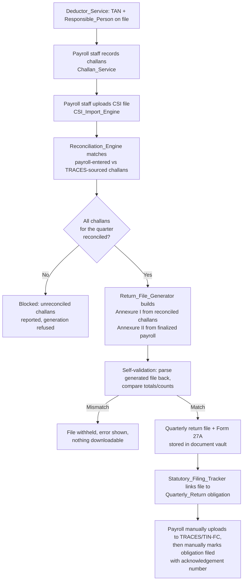

# Design Document

## Overview

This feature adds five new components around the existing salary-TDS pipeline (`taxDeclaration.service.ts`, `payrollCalculate.service.ts`, `statutory-regime.ts`) and the existing `statutory_filing_record` tracker, so that payroll staff can:

1. Record the employer's TAN and Responsible_Person once (Deductor_Service), instead of every downstream document guessing or omitting it.
2. Record deposited TDS challans as structured, validated fields (Challan_Service) instead of a free-text challan number.
3. Import the OLTAS CSI file from TRACES (CSI_Import_Engine) and automatically reconcile it against payroll-entered challans (Reconciliation_Engine).
4. Generate an FVU-compatible quarterly return file and Form 27A control chart from actual finalized payroll data (Return_File_Generator), with a built-in self-check before the file is ever offered for download.
5. Track the quarterly return as its own obligation, distinct from the monthly TDS deposit, on the existing filing tracker UI.

Everything here is additive to the live payroll module (`backend/src/modules/payroll/*`). Nothing in `backend/src/modules/payroll-compliance/*` is read, written, imported, or routed through — that module tree is dead code and stays untouched. No component in this design calls out to TRACES, TIN-FC, or the income-tax e-filing portal; every artifact produced here is generated locally and handed to a human to upload (Requirement 13).

## Architecture

### Component placement

All new backend code lives beside the modules it extends, in `backend/src/modules/payroll/`:

```
backend/src/modules/payroll/
  statutory-regime.ts                      (existing, reused unchanged)
  payroll-statutory-filing.routes.ts        (existing, due-date bug fixed here)
  tds-deductor.service.ts                   (new — Deductor_Service)
  tds-deductor.routes.ts                    (new)
  tds-challan.service.ts                    (new — Challan_Service, incl. CIN derivation)
  tds-challan.routes.ts                     (new)
  tds-csi-import.service.ts                 (new — CSI_Import_Engine)
  tds-reconciliation.service.ts             (new — Reconciliation_Engine)
  tds-quarterly-obligation.service.ts       (new — Quarterly_Return obligation CRUD)
  tds-quarterly-obligation.routes.ts        (new)
  tds-return-file-generator.service.ts      (new — Return_File_Generator: Annexure I/II, FVU text, Form 27A, self-validation)
  tds-return-file-generator.routes.ts       (new)
```

Frontend additions live beside the existing pages in `src/pages/payroll/`, as new panels rendered inside the existing `StatutoryCenter.tsx` (which already aggregates several statutory sub-views) and a new obligation section merged into `StatutoryFilingTracker.tsx`'s display. No existing page is replaced.

### How a quarter's filing flows through the new components



### Why a new table for the quarterly obligation, not a row in `statutory_filing_record`

`statutory_filing_record` is keyed by `(filing_month, filing_type, state_code)` — a calendar month plus a type. The existing `TDS_24Q`/`TDS_138` rows in that table already represent the **monthly TDS_Deposit** obligation (due the 7th of the following month), not the quarterly return; the enum name is a historical artifact of the source form, not evidence that the quarterly return was ever tracked. Requirement 5.1 requires the Quarterly_Return obligation to be keyed by **TAN, financial year, and quarter** — a key shape `statutory_filing_record` cannot express without changing what its existing unique key means for every other filing type it tracks (EPF, ESIC, PT, LWF). Retrofitting that key onto the existing table would risk exactly the kind of silent conflation Requirement 5 exists to end.

The design therefore adds a dedicated `quarterly_return_obligation` table (owned by the new `tds-quarterly-obligation.service.ts`) and leaves `statutory_filing_record` as the tracker for the monthly obligations it already tracks, with the due-date bug fixed in place. `StatutoryFilingTracker.tsx` calls both endpoints and renders the quarterly obligations as an additional section — the "Statutory_Filing_Tracker" as a user-facing concept spans both data sources, exactly as the glossary describes it as "extended" rather than replaced.

## Components and Interfaces

### Deductor_Service (`tds-deductor.service.ts` / `tds-deductor.routes.ts`)

Owns `tds_deductor` and `tds_deductor_branch`.

```ts
interface DeductorInput {
  tan: string;                          // AAAA99999A
  deductorName: string;                 // <=200 chars
  registeredAddress: string;            // <=500 chars
  responsiblePersonName: string;        // <=150 chars
  responsiblePersonDesignation: string; // <=100 chars
  responsiblePersonPan: string;         // AAAAA9999A
  branchIds?: string[];                 // omitted/empty = organization-wide
}

async function createDeductor(input: DeductorInput, actorUserId: string): Promise<DeductorRecord>;
async function updateDeductor(tanId: string, input: Partial<DeductorInput>, actorUserId: string): Promise<DeductorRecord>;
async function deactivateDeductor(tanId: string, actorUserId: string): Promise<void>;
async function findActiveDeductorForScope(scope: { branchId?: string }): Promise<DeductorRecord | null>;
async function listDeductors(includeInactive?: boolean): Promise<DeductorRecord[]>;
```

`findActiveDeductorForScope` is the function every downstream document-generation path (Form 16/130 Part B, Return_File_Generator, Form 27A) calls to resolve the TAN for a scope. Resolution order: an active TAN explicitly mapped to the employee's `branch_id` wins; if none is mapped to that branch, an active org-wide TAN (no branch mappings at all) applies; if neither exists, it returns `null` and every caller is contractually required to treat `null` as "no active TAN for this scope" rather than substitute a default.

Routes (`requireRole("admin","super_admin","payroll_head","payroll","payroll_hr","finance")` on all mutating routes, matching the existing `PAYROLL_ROLES` set used by `tds-certificate-part-a.routes.ts`):

- `POST /api/payroll/tds-deductor` — create
- `PATCH /api/payroll/tds-deductor/:id` — update
- `POST /api/payroll/tds-deductor/:id/deactivate` — deactivate
- `GET /api/payroll/tds-deductor` — list (read allowed for the same role set; no employee-self access, this is not employee-facing data)

### Challan_Service (`tds-challan.service.ts` / `tds-challan.routes.ts`)

Owns `tds_challan` rows with `source = 'payroll_entered'`.

```ts
interface ChallanInput {
  deductorId: string;       // FK to tds_deductor
  filingMonth: string;      // YYYY-MM, the TDS_Deposit month this challan pays
  bsrCode: string;          // exactly 7 digits
  challanTenderDate: string;// ISO date, within [1st of filingMonth, today]
  challanSerialNumber: number; // positive integer, <=5 digits
  depositedAmount: number;  // 0.01 .. 999999999.99, <=2 decimals
}

function deriveCin(bsrCode: string, challanTenderDate: string, challanSerialNumber: number): string;
// CIN = bsrCode + DDMMYYYY(challanTenderDate) + String(challanSerialNumber)

async function recordChallan(input: ChallanInput, actorUserId: string): Promise<ChallanRecord>;
async function updateChallan(id: string, input: Partial<ChallanInput>, actorUserId: string): Promise<ChallanRecord>;
async function listChallansForObligation(deductorId: string, financialYearStart: number, quarter: Quarter): Promise<ChallanRecord[]>;
```

`deriveCin` is a pure function used identically here, in `tds-csi-import.service.ts` (to compute the CIN of a parsed CSI record), and in `tds-reconciliation.service.ts` (to compare CINs) — one implementation, imported everywhere a CIN is computed or compared, so the "case/whitespace-insensitive" comparison rule in the glossary cannot drift between call sites.

Routes, same role set as Deductor_Service:

- `POST /api/payroll/tds-challan`
- `PATCH /api/payroll/tds-challan/:id`
- `GET /api/payroll/tds-challan?deductorId=&financialYear=&quarter=`

### CSI_Import_Engine (`tds-csi-import.service.ts`)

Parses an uploaded CSI text file into `tds_challan` rows with `source = 'traces_csi'`.

```ts
interface CsiParseResult {
  records: Array<{ bsrCode: string; challanTenderDate: string; challanSerialNumber: number; depositedAmount: number; tan: string }>;
}

function parseCsiFile(fileText: string, expectedTan: string, dateRange: { from: string; to: string }): CsiParseResult;
// Throws CsiParseError, naming the failing line number and field, on:
//  - any line that does not match the expected CSI record structure
//  - any parsed record whose TAN != expectedTan
//  - any parsed record whose challanTenderDate falls outside dateRange
// Parsing is all-or-nothing: a single bad line/record fails the whole file,
// nothing from that upload is persisted.

async function importCsiFile(opts: {
  deductorId: string; tan: string; dateRange: { from: string; to: string };
  fileBuffer: Buffer; originalFilename: string; actorUserId: string;
}): Promise<{ batchId: string; importedCount: number; skippedDuplicateCount: number }>;
```

`importCsiFile` enforces the 10 MB limit via multer (`limits: { fileSize: 10 * 1024 * 1024 }`, same pattern as `tds-certificate-part-a.routes.ts`'s upload limiter), calls `parseCsiFile`, then persists each parsed record as `source = 'traces_csi'`, skipping — not erroring on — any record whose derived CIN already exists as a `traces_csi` row for that deductor (Requirement 6.5's idempotence). After a successful import it calls into `tds-reconciliation.service.ts` to re-run matching for every affected `filing_month`/quarter.

Route: `POST /api/payroll/tds-challan/csi-import` (multipart upload, same role set), mounted from `tds-challan.routes.ts` since it operates on the same table.

### Reconciliation_Engine (`tds-reconciliation.service.ts`)

Pure matching logic plus the read-side status used to gate filing.

```ts
type ReconciliationStatus = "unreconciled" | "reconciled" | "amount_discrepancy" | "unmatched";

function normalizeCin(cin: string): string; // trim + uppercase — the single place the
                                             // "case/whitespace-insensitive" CIN comparison rule lives

async function reconcileForDeductor(deductorId: string): Promise<{ updated: number }>;
// For every payroll_entered challan without a terminal reconciliation status:
//   - find a traces_csi record with normalizeCin(cin) equal
//   - none found            -> status = 'unmatched'
//   - found, amounts equal  -> status = 'reconciled', matched_challan_id set
//   - found, amounts differ -> status = 'amount_discrepancy', discrepancy stored (both amounts)

async function reconciliationSummaryForObligation(
  deductorId: string, financialYearStart: number, quarter: Quarter,
): Promise<{
  allReconciled: boolean;
  challans: Array<{ id: string; cin: string; status: ReconciliationStatus }>;
  tracesOnlyDeposits: Array<{ cin: string; depositedAmount: number }>; // "deposit with no filed record"
}>;
```

`reconciliationSummaryForObligation` is the single read path every gate in the system uses (Return_File_Generator, Form 27A generation, mark-as-filed) — see "The reconciliation gate" under Error Handling below.

### Return_File_Generator (`tds-return-file-generator.service.ts` / `.routes.ts`)

```ts
interface GenerateResult {
  fileId: string;
  quarterlyReturnDownloadUrl: string;   // via document-vault download token
  form27aDownloadUrl: string;           // via document-vault download token
  formDesignation: "24Q" | "138";
  totals: { challanCount: number; taxDeducted: number; deducteeCount: number; amountPaid: number };
  excludedEmployees: Array<{ employeeId: string; reason: "missing_pan" | "payroll_not_finalized" }>;
}

async function generateQuarterlyReturn(
  deductorId: string, financialYearStart: number, quarter: Quarter, actorUserId: string,
): Promise<GenerateResult>;
// Throws (no file produced, nothing persisted) when:
//  - no active TAN for the resolved scope
//  - reconciliation is incomplete (see the reconciliation gate)
//  - the statutory regime cannot be resolved for financialYearStart
//  - Responsible_Person name/designation/PAN is missing (blocks Form 27A too)
// On success: builds Annexure I + II, generates the FVU-style text file and the
// Form 27A chart, self-validates (see below), and ONLY on a passing self-validation
// persists both files to the document vault, links them to the obligation
// (superseding any prior file for the same obligation), and returns download tokens
// for both in one response — satisfying "single download action" (Req 10.5).
```

#### Building Annexure I and Annexure II

- **Annexure I** (challan/deposit summary): one row per `tds_challan` row with `source = 'payroll_entered'` and `reconciliation_status = 'reconciled'` for the deductor+quarter. Row fields: BSR code, tender date, serial number, deposited amount, CIN. The generator refuses to run at all (see the reconciliation gate) if any associated challan is not reconciled, so this set is exactly "all challans for the quarter" once generation is allowed to proceed.
- **Annexure II** (deductee/salary detail, required for Q4): one row per employee under the TAN's branch scope with a **finalized** `salary_prep_run`/`salary_prep_line` for the financial year to date (run status in the closed set already defined by `payroll-lifecycle.ts`'s `CLOSED_RUN_STATUSES`/`run-status.ts`'s case-insensitive check — reused, not reimplemented). An employee is **excluded** from Annexure II, and reported in `excludedEmployees`, when:
  - `employees.pan_number` (resolved via the same `resolvePii(pan_number_encrypted, pan_number)` pattern already used in `payroll.routes.ts`) is empty, or
  - that employee has no finalized payroll line for the quarter being filed.
  No row is ever emitted with a blank PAN or from a provisional/draft line.

#### FVU-compatible file layout (structural, not the full NSDL byte-spec)

The generator produces a plain-text, line-oriented file mirroring the shape of a real NSDL/Protean FVU input file at a structural level:

```
BH|<TAN>|<FormDesignation>|<FinancialYear>|<Quarter>|<DeductorName>|<RPName>|<RPDesignation>|<RPPAN>
CD|<BSRCode>|<TenderDateDDMMYYYY>|<SerialNumber>|<DepositedAmount>|<CIN>
   ... one CD line per Annexure I row ...
DD|<EmployeePAN>|<EmployeeName>|<GrossSalary>|<StandardDeduction>|<TaxableIncome>|<TaxDeducted>|<Section>
   ... one DD line per Annexure II row ...
FT|<ChallanCount>|<TotalTaxDeducted>|<DeducteeCount>|<TotalAmountPaid>
```

`BH` (batch header), `CD` (challan detail / Annexure I), `DD` (deductee detail / Annexure II), and `FT` (file trailer, carrying the totals the self-validation step checks) are pipe-delimited records with a fixed field order per record type — the same shape NSDL's real utility uses, without replicating its exact field widths, encoding quirks, or full field catalogue. This keeps the generator honest about what it validates (Requirement 9) without the design overclaiming FVU byte-for-byte conformance, consistent with the glossary's own statement that "this feature produces a file intended to pass FVU validation; it does not run the FVU utility itself."

#### Self-validation (parse-back)

```ts
interface ParsedReturnFile {
  challans: Array<{ bsrCode: string; tenderDate: string; serialNumber: number; amount: number; cin: string }>;
  deductees: Array<{ pan: string; taxDeducted: number }>;
  trailerTotals: { totalTaxDeducted: number; deducteeCount: number };
}

function parseQuarterlyReturnFile(fileText: string): ParsedReturnFile;
// The exact structural inverse of the BH/CD/DD/FT generator above — same record-type
// prefixes, same field order. Generator and parser are written and tested as an
// inverse pair (generate -> parse round trip), the standard property-based-testing
// pattern for anything that serializes.

function selfValidate(generated: string, source: { reconciledChallanTotal: number; sourceEmployeeCount: number }):
  { ok: true } | { ok: false; reason: "tax_total_mismatch" | "deductee_count_mismatch"; parsed: number; expected: number };
```

`generateQuarterlyReturn` always calls `parseQuarterlyReturnFile` on its own output and `selfValidate` against the same reconciled-challan sum and finalized-employee count it built the file from, **before** persisting anything (Requirement 9.4 — there is no configuration flag that skips this; the call is unconditional in the function body, not behind an `if`). A `tax_total_mismatch` beyond ₹1 or any `deductee_count_mismatch` aborts the generation with both the parsed and expected figures in the error; no vault entry, no obligation link update, no download token is created.

#### Form 27A control chart

Generated in the same call, from the same reconciled/finalized data already assembled for the return file (so its totals are computed from, not independently re-derived from, that data — guaranteeing numeric agreement per Requirement 10.3). Rendered as a simple structured document (HTML-to-PDF or a text/PDF template — implementation detail left to the build phase) containing TAN, Responsible_Person name/designation/PAN, total deductee count, total amount paid, total tax deducted. If any Responsible_Person field is missing, generation of **both** artifacts is blocked before any file is written, and the existing Deductor_Service record is left untouched.

#### Storage: reusing the document vault

Both generated files are registered via `registerUpload()` from `document-vault/documentVault.service.ts` — the same call `tds-certificate-part-a.routes.ts` makes — with `category: "quarterly_return_file"` / `"form_27a_chart"` and `accessLevel: "payroll"`. Download access goes through `issueDownloadToken()` + the existing token-consuming file route, exactly like Part A's download-token flow. No new storage or download mechanism is introduced.

Routes (same `PAYROLL_ROLES` set, scoped to the TAN's branch/org scope via `hasScopedAccess`):

- `POST /api/payroll/tds-quarterly-return/:deductorId/:financialYear/:quarter/generate`
- `GET /api/payroll/tds-quarterly-return/:deductorId/:financialYear/:quarter` — status, totals, exclusions, download tokens if a current file exists

### Quarterly_Return obligation tracking (`tds-quarterly-obligation.service.ts` / `.routes.ts`)

```ts
type Quarter = "Q1" | "Q2" | "Q3" | "Q4";

async function initializeQuarterlyObligation(
  deductorId: string, financialYearStart: number, quarter: Quarter,
): Promise<{ created: boolean }>;
// Due date: Q1/Q2/Q3 -> last day of the month following quarter end; Q4 -> 31 May same year.
// Form designation: statutoryRegimeForFinancialYear(financialYearStart) — same resolver
// statutory-regime.ts already exposes, not reimplemented.
// INSERT IGNORE on (deductor_id, financial_year_start, quarter) — idempotent, matching
// the existing initialize/:month route's own INSERT IGNORE pattern.

async function markObligationFiled(
  obligationId: string, acknowledgementNumber: string, actorUserId: string,
): Promise<ObligationRecord>;
// Denies (reports every unmet condition) unless: a quarterly_return_file is linked,
// at least one challan is associated with the obligation, every associated challan is
// reconciled, AND acknowledgementNumber is present and <=50 chars.
```

Routes, same role set as the existing `mark-filed` route on `payroll-statutory-filing.routes.ts` (`admin`, `super_admin`, `finance`, `payroll_head`):

- `POST /api/payroll/tds-quarterly-return-obligation/initialize`
- `GET /api/payroll/tds-quarterly-return-obligation?deductorId=&financialYear=`
- `PATCH /api/payroll/tds-quarterly-return-obligation/:id/mark-filed`

### Fix to `payroll-statutory-filing.routes.ts` (Requirement 4)

`defaultDueDate()` currently returns the 7th of the following month unconditionally for `TDS_24Q`/`TDS_138`, including when `filingMonth` is March — a bug, since the statutory TDS deposit due date for March is 30 April, not 7 April. The fix branches on the filing month:

```ts
case "TDS_24Q":
case "TDS_138": {
  const [, mo] = filingMonth.split("-");
  return mo === "03" ? `${yr}-04-30` : `${next}-07`;
}
```

For existing rows already carrying the wrong `04-07` due date for a March filing month, a one-time backfill migration (new `backend/sql/xxxx_correct_march_tds_due_date.sql`) corrects `due_date` to `04-30` of the same year for every `statutory_filing_record` row where `filing_type IN ('TDS_24Q','TDS_138')`, `filing_month LIKE '%-03'`, and `due_date` is the 7th of April. As a defensive backstop for any row inserted by an older code path before that migration runs, the existing GET list route's status computation (which already recomputes `overdue` in memory rather than trusting the stored `status` column) is extended to self-heal: if it encounters such a row, it corrects `due_date` in the database via the same recomputation and then evaluates `overdue` against the corrected value — so the incorrect due date and any overdue flag derived from it cannot persist past the next read, satisfying Requirement 4's Acceptance Criteria 3 and 4 without requiring a new endpoint.

## Data Models

```sql
-- Deductor_Service
CREATE TABLE tds_deductor (
  id                              CHAR(36)      NOT NULL DEFAULT (UUID()),
  tan                             VARCHAR(10)   NOT NULL,   -- AAAA99999A
  deductor_name                   VARCHAR(200)  NOT NULL,
  registered_address              VARCHAR(500)  NOT NULL,
  responsible_person_name         VARCHAR(150)  NOT NULL,
  responsible_person_designation  VARCHAR(100)  NOT NULL,
  responsible_person_pan          VARCHAR(10)   NOT NULL,   -- AAAAA9999A
  is_active                       TINYINT(1)    NOT NULL DEFAULT 1,
  created_by                      CHAR(36)      NOT NULL,
  created_at                      DATETIME      NOT NULL DEFAULT CURRENT_TIMESTAMP,
  updated_at                      DATETIME      NOT NULL DEFAULT CURRENT_TIMESTAMP ON UPDATE CURRENT_TIMESTAMP,
  deactivated_at                  DATETIME      NULL,
  deactivated_by                  CHAR(36)      NULL,
  PRIMARY KEY (id),
  UNIQUE KEY uk_tds_deductor_tan_active (tan, is_active),
  KEY idx_tds_deductor_active (is_active)
) ENGINE=InnoDB DEFAULT CHARSET=utf8mb4 COLLATE=utf8mb4_unicode_ci;
-- Note: uk on (tan, is_active) permits re-creating a TAN after a prior record with
-- the same TAN was deactivated (is_active=0), while still preventing two *active*
-- rows for the same TAN (Requirement 1.8), since a duplicate active insert collides
-- on (tan, 1).

CREATE TABLE tds_deductor_branch (
  id           CHAR(36)  NOT NULL DEFAULT (UUID()),
  deductor_id  CHAR(36)  NOT NULL,
  branch_id    CHAR(36)  NOT NULL,
  created_at   DATETIME  NOT NULL DEFAULT CURRENT_TIMESTAMP,
  PRIMARY KEY (id),
  UNIQUE KEY uk_deductor_branch (deductor_id, branch_id),
  FOREIGN KEY (deductor_id) REFERENCES tds_deductor(id) ON DELETE CASCADE,
  KEY idx_branch (branch_id)
) ENGINE=InnoDB DEFAULT CHARSET=utf8mb4 COLLATE=utf8mb4_unicode_ci;
-- No row for a deductor = organization-wide TAN (Requirement 1.3).

-- Challan_Service + CSI_Import_Engine + Reconciliation_Engine (one table, two sources)
CREATE TABLE tds_challan (
  id                     CHAR(36)      NOT NULL DEFAULT (UUID()),
  deductor_id            CHAR(36)      NOT NULL,
  source                 ENUM('payroll_entered','traces_csi') NOT NULL,
  filing_month           VARCHAR(7)    NULL,       -- YYYY-MM; set for payroll_entered, may be null for traces_csi until matched
  bsr_code               CHAR(7)       NOT NULL,
  challan_tender_date    DATE          NOT NULL,
  challan_serial_number  INT           NOT NULL,
  deposited_amount       DECIMAL(12,2) NOT NULL,
  cin                    VARCHAR(23)   NOT NULL,    -- derived: bsr_code(7) + DDMMYYYY(8) + serial(<=5) + case-normalized on compare, not on storage
  reconciliation_status  ENUM('unreconciled','reconciled','amount_discrepancy','unmatched') NOT NULL DEFAULT 'unreconciled',
  matched_challan_id     CHAR(36)      NULL,        -- for payroll_entered rows once matched, points to the traces_csi row
  discrepancy_amount     DECIMAL(12,2) NULL,         -- traces-reported amount, when status = amount_discrepancy
  import_batch_id        CHAR(36)      NULL,         -- for traces_csi rows, FK to tds_csi_import_batch
  created_by              CHAR(36)      NOT NULL,
  created_at              DATETIME      NOT NULL DEFAULT CURRENT_TIMESTAMP,
  updated_at              DATETIME      NOT NULL DEFAULT CURRENT_TIMESTAMP ON UPDATE CURRENT_TIMESTAMP,
  PRIMARY KEY (id),
  UNIQUE KEY uk_challan_cin_source (deductor_id, cin, source),  -- Req 3.8 (payroll_entered) and 6.5 (traces_csi), same mechanism
  FOREIGN KEY (deductor_id) REFERENCES tds_deductor(id),
  FOREIGN KEY (matched_challan_id) REFERENCES tds_challan(id),
  KEY idx_challan_month (deductor_id, filing_month),
  KEY idx_challan_status (reconciliation_status)
) ENGINE=InnoDB DEFAULT CHARSET=utf8mb4 COLLATE=utf8mb4_unicode_ci;

CREATE TABLE tds_csi_import_batch (
  id               CHAR(36)     NOT NULL DEFAULT (UUID()),
  deductor_id      CHAR(36)     NOT NULL,
  date_range_from  DATE         NOT NULL,
  date_range_to    DATE         NOT NULL,
  original_filename VARCHAR(255) NOT NULL,
  imported_count   INT          NOT NULL,
  skipped_duplicate_count INT   NOT NULL DEFAULT 0,
  imported_by      CHAR(36)     NOT NULL,
  imported_at      DATETIME     NOT NULL DEFAULT CURRENT_TIMESTAMP,
  PRIMARY KEY (id),
  FOREIGN KEY (deductor_id) REFERENCES tds_deductor(id),
  KEY idx_batch_deductor (deductor_id)
) ENGINE=InnoDB DEFAULT CHARSET=utf8mb4 COLLATE=utf8mb4_unicode_ci;

-- Quarterly_Return obligation tracking (extends the Statutory_Filing_Tracker concept,
-- distinct table from statutory_filing_record — see Architecture section)
CREATE TABLE quarterly_return_obligation (
  id                     CHAR(36)      NOT NULL DEFAULT (UUID()),
  deductor_id            CHAR(36)      NOT NULL,
  financial_year_start   SMALLINT      NOT NULL,   -- e.g. 2026 for FY 2026-27
  quarter                ENUM('Q1','Q2','Q3','Q4') NOT NULL,
  form_designation       VARCHAR(10)   NOT NULL,   -- '24Q' or '138', resolved at initialize time
  due_date               DATE          NOT NULL,
  current_file_id        CHAR(36)      NULL,       -- FK to quarterly_return_file, current (non-superseded) file
  status                 ENUM('pending','filed') NOT NULL DEFAULT 'pending',
  acknowledgement_number VARCHAR(50)   NULL,
  filed_by               CHAR(36)      NULL,
  filed_at               DATETIME      NULL,
  created_at             DATETIME      NOT NULL DEFAULT CURRENT_TIMESTAMP,
  updated_at             DATETIME      NOT NULL DEFAULT CURRENT_TIMESTAMP ON UPDATE CURRENT_TIMESTAMP,
  PRIMARY KEY (id),
  UNIQUE KEY uk_qro_key (deductor_id, financial_year_start, quarter),  -- Requirement 5.1 key shape
  FOREIGN KEY (deductor_id) REFERENCES tds_deductor(id)
) ENGINE=InnoDB DEFAULT CHARSET=utf8mb4 COLLATE=utf8mb4_unicode_ci;

-- Return_File_Generator output records
CREATE TABLE quarterly_return_file (
  id                          CHAR(36)      NOT NULL DEFAULT (UUID()),
  obligation_id               CHAR(36)      NOT NULL,
  vault_document_id           CHAR(36)      NOT NULL,  -- the FVU-style text file, in document_vault_inventory
  form27a_vault_document_id   CHAR(36)      NOT NULL,  -- the Form 27A chart, in document_vault_inventory
  form_designation            VARCHAR(10)   NOT NULL,
  challan_count                INT           NOT NULL,
  total_tax_deducted           DECIMAL(14,2) NOT NULL,
  deductee_count                INT           NOT NULL,
  total_amount_paid             DECIMAL(14,2) NOT NULL,
  excluded_employees_json      JSON          NULL,      -- [{employee_id, reason}]
  generated_by                 CHAR(36)      NOT NULL,
  generated_at                  DATETIME      NOT NULL DEFAULT CURRENT_TIMESTAMP,
  superseded_at                 DATETIME      NULL,      -- set when a newer generation supersedes this row
  PRIMARY KEY (id),
  FOREIGN KEY (obligation_id) REFERENCES quarterly_return_obligation(id),
  KEY idx_file_obligation (obligation_id)
) ENGINE=InnoDB DEFAULT CHARSET=utf8mb4 COLLATE=utf8mb4_unicode_ci;
-- Every persisted row here has already passed self-validation — a failed generation
-- is never written here at all (Requirement 9), so there is no "invalid" status to model.
```

`statutory_filing_record`'s existing schema is unchanged except for the `defaultDueDate()` logic fix and the backfill migration described above; no new column is added to it.

## Correctness Properties

*A property is a characteristic or behavior that should hold true across all valid executions of a system—essentially, a formal statement about what the system should do. Properties serve as the bridge between human-readable specifications and machine-verifiable correctness guarantees.*

### Property 1: TAN record round trip and branch scoping

For any valid TAN input (matching all field constraints) with any set of branch ids (including the empty set), creating the deductor record and reading it back returns every field unchanged, and `findActiveDeductorForScope` resolves it for exactly the branches associated with it (or for every scope, if the branch set is empty).

**Validates: Requirements 1.1, 1.2, 1.3**

### Property 2: Invalid TAN format rejected

For any string that does not match `AAAA99999A`, submitting it as a TAN is rejected, no record is persisted, and the returned validation error identifies the TAN field.

**Validates: Requirements 1.4**

### Property 3: Invalid Responsible_Person PAN format rejected

For any string that does not match the ten-character PAN format, submitting it as the Responsible_Person's PAN is rejected, no record is persisted, and the returned validation error identifies the PAN field.

**Validates: Requirements 1.5**

### Property 4: Duplicate active TAN rejected

For any TAN value equal to an existing active TAN record's value, submitting a new record with that value is rejected, and the set of active TAN records is unchanged by the attempt.

**Validates: Requirements 1.8**

### Property 5: Deactivation excludes from active scope but preserves history

For any active TAN record, deactivating it removes it from every subsequent `findActiveDeductorForScope` resolution for any branch or organization scope it previously covered, while the record itself remains retrievable through a history/audit lookup.

**Validates: Requirements 1.9**

### Property 6: Missing active TAN blocks generation and never yields a placeholder

For any branch or organization scope with no active TAN record, a request to generate a Quarterly_Return file or Form_27A control chart for that scope is refused, no file or chart is produced, and the refusal identifies the specific scope lacking a TAN — so no output ever contains an empty, null, or placeholder TAN value, because none is ever produced in this state.

**Validates: Requirements 2.1, 2.5**

### Property 7: Active TAN populates Form 16/130 Part B correctly

For any employee whose branch or organization scope resolves to an active TAN record, the generated Form 16/130 Part B data's TAN and Responsible_Person name/designation fields equal that TAN record's corresponding fields.

**Validates: Requirements 2.2**

### Property 8: Missing TAN produces an explicit sentinel, never a fabricated or blank value

For any employee whose scope has no active TAN record, the TAN and Responsible_Person fields on that employee's generated Part B data are populated with the same explicit missing-data indicator every time, and that indicator is never a blank string, null, or any value that could be mistaken for a real TAN or Responsible_Person value.

**Validates: Requirements 2.3**

### Property 9: Missing-TAN employees are always surfaced in the completeness report

For any set of employees processed for Form 16/130 Part B generation, every employee whose scope lacks an active TAN appears in the accompanying data-completeness report, and no employee with an active TAN for their scope appears in it for that reason.

**Validates: Requirements 2.4**

### Property 10: Challan structured fields round trip

For any valid challan submission (BSR code, tender date, serial number, amount all satisfying their format constraints), recording it and reading it back returns all four fields as distinct values equal to the input.

**Validates: Requirements 3.1**

### Property 11: BSR code format validation

For any string that is not exactly seven digits, submitting it as a challan's BSR code is rejected, no record is persisted, and the error identifies the BSR code field.

**Validates: Requirements 3.2**

### Property 12: Challan serial number format validation

For any value that is not a positive integer of five digits or fewer, submitting it as a challan's serial number is rejected, no record is persisted, and the error identifies the serial number field.

**Validates: Requirements 3.3**

### Property 13: Challan tender date window validation

For any date before the first day of the challan's filing month, or after the current date, submitting it as the challan tender date is rejected, no record is persisted, and the error identifies the tender date field.

**Validates: Requirements 3.4**

### Property 14: Deposited amount format validation

For any value that is not a positive number between 0.01 and 999,999,999.99 with at most two decimal places, submitting it as the deposited amount is rejected, no record is persisted, and the error identifies the amount field.

**Validates: Requirements 3.5**

### Property 15: Missing required field is named in the rejection

For any challan submission missing one of BSR code, tender date, serial number, or deposited amount, the submission is rejected, no record is persisted, and the error identifies specifically which field is missing.

**Validates: Requirements 3.6**

### Property 16: CIN derivation is a deterministic concatenation

For any valid BSR code, tender date, and serial number, `deriveCin` always returns the exact concatenation of the BSR code, the tender date formatted as `DDMMYYYY`, and the serial number, in that order, with no other transformation.

**Validates: Requirements 3.7**

### Property 17: Duplicate CIN among payroll-entered challans rejected

For any challan submission whose derived CIN equals an existing payroll-entered challan record's CIN for the same deductor, the submission is rejected, and no duplicate payroll-entered record with that CIN is persisted.

**Validates: Requirements 3.8**

### Property 18: TDS deposit due-date computation

For any filing month, `defaultDueDate` for `TDS_24Q`/`TDS_138` returns the 7th of the following calendar month (rolling over to the 7th of January of the next year when the filing month is December) for every filing month except March, and returns the 30th of April of the same calendar year when the filing month is March.

**Validates: Requirements 4.1, 4.2**

### Property 19: Existing incorrect March due dates are corrected on recomputation

For any `statutory_filing_record` row for a March TDS_Deposit obligation whose stored due date is the 7th of April, the next due-date recomputation for that row updates its due date to the 30th of April of the same calendar year, and leaves the due date of any non-March or already-correct row unchanged.

**Validates: Requirements 4.3**

### Property 20: Overdue status is always consistent with the current due date

For any `statutory_filing_record` row and any evaluation date, the row's computed overdue flag equals `(evaluation date > row's current due date)` regardless of what the due date or overdue flag were before the most recent recomputation — so a row corrected from an incorrect 7-April due date to 30-April is never left with an overdue flag that was only true under the incorrect date.

**Validates: Requirements 4.4**

### Property 21: Quarterly_Return obligation key is structurally distinct from the monthly obligation

For any TAN, financial year, and quarter, the Quarterly_Return obligation record for that triplet is a different record from any `statutory_filing_record` TDS_Deposit row for any calendar month within that quarter — the two are never merged, never share a primary key, and updating one never mutates the other.

**Validates: Requirements 5.1**

### Property 22: Quarterly_Return due-date computation

For any financial year and quarter, `initializeQuarterlyObligation` sets the due date to the last day of the month following the quarter's end when the quarter ends in June, September, or December, and to the 31st of May of the same calendar year when the quarter ends in March.

**Validates: Requirements 5.2, 5.3**

### Property 23: Form designation is resolved consistently everywhere it appears

For any financial year, the form designation recorded on the Quarterly_Return obligation, the form designation tagged on the generated Quarterly_Return file, and the form designation implied by the layout of the generated Form_27A control chart are always identical to each other and always equal to `statutoryRegimeForFinancialYear(financialYear).quarterlyReturnForm` — none of the three resolves the 24Q/138 choice independently.

**Validates: Requirements 5.4, 8.5, 10.1**

### Property 24: Tracker view reflects the obligation's stored state

For any Quarterly_Return obligation with a linked generated file, the Statutory_Filing_Tracker view displays that file's generation timestamp equal to the stored value; for any obligation marked as filed, the view displays a filed status; for any obligation without one of these, the view never fabricates the corresponding display value.

**Validates: Requirements 5.5, 5.6**

### Property 25: Obligation initialization is idempotent

For any TAN, financial year, and quarter, calling `initializeQuarterlyObligation` twice in succession leaves exactly one obligation record for that key, with the same due date and form designation as after the first call.

**Validates: Requirements 5.7**

### Property 26: CSI file parse round trip

For any set of structured challan records rendered into a syntactically valid CSI-format text file (for the TAN and date range the records fall within), parsing that file with `parseCsiFile` returns records equal to the original set.

**Validates: Requirements 6.1**

### Property 27: Malformed or oversized CSI upload is rejected atomically

For any CSI file exceeding 10 MB, or any syntactically valid CSI file with one line or field mutated to break the expected structure, the upload is rejected in its entirety, no parsed records from that upload are persisted, and the error identifies the offending line or field.

**Validates: Requirements 6.2**

### Property 28: TAN or date-range mismatch rejects the whole upload

For any CSI file containing at least one record whose TAN differs from the TAN the upload was submitted under, or whose tender date falls outside the submitted date range, the entire upload is rejected — including any other records in the same file that would otherwise have been valid — and no records from that upload are persisted.

**Validates: Requirements 6.3**

### Property 29: Payroll-entered and TRACES-sourced challans remain distinct and both retained

For any sequence of payroll-entered challan submissions and CSI imports for the same deductor, every payroll-entered record remains queryable as `source = 'payroll_entered'` and every TRACES-sourced record as `source = 'traces_csi'` after the operations, with neither set overwriting or removing rows from the other.

**Validates: Requirements 6.4**

### Property 30: CSI import is idempotent per CIN

For any CSI file imported twice (or two CSI files sharing a record with the same CIN) for the same TAN, the second import retains the original TRACES-sourced record for that CIN unchanged and does not create a duplicate.

**Validates: Requirements 6.5**

### Property 31: Every sensitive action produces a matching audit entry

For any TAN create/modify/deactivate, challan create/modify, CSI import completion, or Quarterly_Return file/Form_27A generation or download performed by an authenticated actor, a corresponding `sensitive_action_log` entry is written carrying the actor's identity and the action-specific required fields (TAN, CIN, financial-year quarter, or entity id and action type, as applicable) — for every such action, with no action of these kinds occurring without one.

**Validates: Requirements 1.7, 3.9, 6.6, 12.3, 12.4**

### Property 32: CIN-normalized reconciliation matching with amount comparison

For any payroll-entered challan and any TRACES-sourced challan sharing the same deductor, if `normalizeCin` of their CINs is equal, then: when their deposited amounts are also equal, the payroll-entered record is marked `reconciled`; when the amounts differ by any nonzero amount, it is marked `amount_discrepancy` with both amounts reported and remains outside `reconciled` status until the discrepancy is resolved. This holds regardless of letter case or leading/trailing whitespace differences between the two CIN strings.

**Validates: Requirements 7.1, 7.3**

### Property 33: Unmatched payroll-entered challans are surfaced

For any payroll-entered challan whose CIN has no matching TRACES-sourced record after a CSI import covering its tender date, its status is `unmatched` and it appears in the Statutory_Filing_Tracker view's unmatched list.

**Validates: Requirements 7.2**

### Property 34: TRACES deposits with no payroll record are surfaced

For any TRACES-sourced challan with no corresponding payroll-entered record for the same deductor, it appears in the Statutory_Filing_Tracker view's "deposit with no filed record" list.

**Validates: Requirements 7.4**

### Property 35: The reconciliation gate blocks every downstream action until every challan is reconciled, and names every unmet condition

For any Quarterly_Return obligation with one or more associated challans not in `reconciled` status: (a) `generateQuarterlyReturn` refuses to produce a file, (b) Form_27A generation is refused, and (c) `markObligationFiled` denies the request — and in each of the three cases, the response enumerates every unreconciled challan (or, for mark-as-filed, every unmet condition among "file generated", "at least one challan associated", and "all challans reconciled") rather than only the first one found.

**Validates: Requirements 7.5, 7.6, 8.3, 10.4, 11.2, 11.3**

### Property 36: Annexure I is built from exactly the reconciled challans

For any deductor and quarter for which generation is allowed to proceed (i.e., the reconciliation gate has passed), the Annexure I rows in the generated file correspond one-to-one, by CIN and amount, to the set of `reconciled` payroll-entered challans for that deductor and quarter — no row from any other status, and no reconciled challan omitted.

**Validates: Requirements 8.1**

### Property 37: Annexure II inclusion and exclusion rules

For any deductor, quarter, and set of employees under its scope: an employee's row appears in Annexure II if and only if that employee has a non-empty PAN on file and a finalized payroll line for the quarter; an employee missing either condition is excluded and reported with the specific matching reason (`missing_pan` or `payroll_not_finalized`), never with a row containing a blank PAN or figures from an unfinalized line.

**Validates: Requirements 8.2, 8.4, 8.7**

### Property 38: Unresolvable statutory regime refuses generation with a specific reason

For any financial year for which `statutoryRegimeForFinancialYear` cannot resolve a regime, `generateQuarterlyReturn` refuses to produce a file and reports that the statutory regime could not be determined for that financial year.

**Validates: Requirements 8.8**

### Property 39: Regeneration always supersedes the prior file, at most one current file per obligation

For any Quarterly_Return obligation, generating a new file when a prior file already exists for it marks the prior file's `superseded_at` and sets the obligation's `current_file_id` to the new file — so that, at any point in time, at most one file per obligation is linked and available for download, and it is always the most recently generated one.

**Validates: Requirements 8.9, 11.1**

### Property 40: Self-validation parse-back reproduces the source Annexure entries

For any successfully built Annexure I and Annexure II data set, generating the file and then parsing it back with `parseQuarterlyReturnFile` yields a challan list and deductee list structurally equivalent (same count, same key fields) to the source data the file was generated from.

**Validates: Requirements 9.1**

### Property 41: Self-validation tax-total tolerance check

For any generated Quarterly_Return file, if the parsed-back total tax deducted (summed from the parsed Annexure I entries) differs from the sum of the reconciled challan amounts used to build the file by more than ₹1, the file is withheld from download, no vault entry or download token is created for it, and the reported error identifies both the parsed-back total and the expected total; if the difference is ₹1 or less, the file is made available.

**Validates: Requirements 9.2**

### Property 42: Self-validation deductee-count check

For any generated Quarterly_Return file, if the parsed-back count of Annexure II entries does not equal the count of employees included from the source payroll data, the file is withheld from download and the reported error identifies both the parsed-back count and the expected count; if the counts are equal, the file is made available.

**Validates: Requirements 9.3**

### Property 43: Form 27A content and totals agree with the Quarterly_Return file

For any successful joint generation, the Form_27A control chart contains the TAN, Responsible_Person name/designation/PAN, and total deductee count, total amount paid, and total tax deducted — and each of these three totals is numerically equal to the corresponding total reported by the Quarterly_Return file generated in the same call.

**Validates: Requirements 10.1, 10.3**

### Property 44: Missing Responsible_Person detail blocks Form 27A and preserves existing data

For any TAN record missing the Responsible_Person's name, designation, or PAN at the time generation is requested, Form_27A generation is blocked, the error identifies which specific field is missing, and the TAN record's existing fields are unchanged by the attempt.

**Validates: Requirements 10.2**

### Property 45: Quarterly_Return file and Form 27A are always offered together

For any successful generation, both the Quarterly_Return file and the Form_27A control chart become available via the same single response/download action — there is no reachable state where one is downloadable and the other requires a separate generation request to obtain.

**Validates: Requirements 10.5**

### Property 46: Acknowledgement/receipt number validation on mark-as-filed

For any mark-as-filed request: a non-empty acknowledgement/provisional receipt number of 50 characters or fewer is accepted and stored verbatim alongside `filed_by`/`filed_at`; an empty or missing number is denied with a "required" message; a number exceeding 50 characters is denied with a "maximum length exceeded" message — and in neither denial case is the obligation's status changed.

**Validates: Requirements 11.4, 11.5, 11.6**

### Property 47: Access control denies unauthorized actors without leaking data

For any user whose roles do not include one of `admin`, `super_admin`, `payroll_head`, `payroll`, `payroll_hr`, `finance` (for TAN/challan/CSI-import actions), or who lacks scope over the TAN's branch/organization (for generation/download actions), every such action is denied with an authorization error, and the denial response body contains no TAN, challan, or return data field.

**Validates: Requirements 1.6, 12.1, 12.2, 12.5, 8.6**

### Property 48: Filed status is displayed only after the manual mark-as-filed action

For any Quarterly_Return obligation state reachable without having gone through `markObligationFiled` — regardless of whether a file has been generated or challans are reconciled — the Statutory_Filing_Tracker view never displays a status label indicating the return has been filed or submitted.

**Validates: Requirements 13.5**

## Error Handling

All new routes follow the existing project convention: `{ success: false, message }` JSON bodies with an appropriate HTTP status, produced by the shared `h()` error-wrapping helper already used in `payroll-statutory-filing.routes.ts` and `tds-certificate-part-a.routes.ts`.

| Condition | Status | Notes |
|---|---|---|
| Field-level validation failure (TAN/PAN/BSR/serial/date/amount format, missing field) | 400 | Message names the specific field, per Requirements 1.4/1.5/3.2–3.6 |
| Duplicate active TAN, duplicate payroll-entered CIN | 409 | Nothing persisted |
| Unauthorized role | 403 | No TAN/challan/return data in the body (Requirement 12.5) |
| Authentication service failure (mirrors `requireRole`'s existing fail-closed behavior) | 503 | Reused as-is, not reimplemented |
| CSI upload: oversized, malformed structure, TAN/date-range mismatch | 400 | Whole upload rejected atomically; message names the failing line/field or the mismatch |
| Reconciliation-gate failure (generate return file, generate Form 27A, mark-as-filed) | 409 | Body enumerates every unmet condition, not just the first |
| Statutory regime unresolvable for the financial year | 422 | Reuses `statutoryRegimeForFinancialYear`'s own failure, not a new resolver |
| Self-validation mismatch (tax total beyond ₹1, deductee count) | 422 | Body includes both the parsed-back and expected figures; no file is persisted or linked |
| Missing Responsible_Person detail for Form 27A | 409 | Names the missing field; existing TAN data unchanged |
| No active TAN for scope | 409 | Names the scope lacking a TAN |
| Acknowledgement number missing or too long | 400 | Distinct messages for "required" vs "exceeds maximum length" |
| Obligation/deductor/challan not found | 404 | |

**The reconciliation gate**, referenced from three separate routes, is implemented once in `tds-reconciliation.service.ts`'s `reconciliationSummaryForObligation` and called by all three callers (`generateQuarterlyReturn`, the Form 27A path inside it, and `markObligationFiled`) rather than reimplemented per call site — this is what Property 35 depends on holding uniformly.

Sensitive-action audit logging uses `logSensitiveAction` (`writeSensitiveActionLog` in `shared/auditLog.ts`) exactly as the existing payroll routes do, including its non-throwing behavior: an audit-log write failure never blocks or rolls back the primary operation, matching the existing contract documented on that function.

Document-vault registration and download tokens reuse `registerUpload`, `issueDownloadToken`, and `consumeDownloadToken` from `document-vault/documentVault.service.ts` unmodified — no new file-storage or token mechanism is introduced by this feature.

## Testing Strategy

**Dual testing approach.** Unit and integration tests cover specific examples, error conditions, and the database/vault integration points (things that don't vary meaningfully with input, e.g. "the route mounts at the expected path", "an audit row is written with the right module_key"). Property-based tests cover the 48 correctness properties above, each as a single property test tagged per the format below, run at a minimum of 100 iterations.

**Property-based testing library.** For the TypeScript backend, `fast-check` (already idiomatic for this codebase's Node/TypeScript stack) is used rather than a hand-rolled generator/shrinker. Each property test is tagged:

`// Feature: tds-statutory-efiling-integration, Property N: <property text>`

**What is NOT property-tested, and why:**

- Requirement 9.4 (no configuration option to skip self-validation) and Requirements 13.1, 13.3, 13.4 (absence of any programmatic TRACES-submission path or bulk mark-filed mechanism) are architecture assertions, not behaviors that vary with input. These are covered by a small fixed set of integration/static checks: enumerating the routes registered on the new routers and asserting none of them calls out to any TRACES/TIN-FC/e-filing network endpoint or bulk-sets `status = 'filed'` outside `markObligationFiled`.
- Requirement 13.2 (manual-upload disclaimer shown alongside every download) is example-based: the disclaimer text is constant and does not vary meaningfully with which TAN or quarter is being downloaded, so a small number of example assertions (disclaimer present and non-empty on the generate response and the tracker's download UI) covers it as well as 100 iterations would.

**Representative unit/integration tests** (non-exhaustive, illustrating the example side of the dual approach):

- `defaultDueDate("2026-03", "TDS_24Q")` returns `2026-04-30` (pins the bugfix exactly, mirroring the pinning-test style already used elsewhere in this module, e.g. `pf_wage_limit`'s regression test).
- `POST /api/payroll/tds-deductor` as a `payroll_hr` user succeeds; as an `employee`-only user returns 403 with no TAN fields in the body.
- CSI import of a real (anonymized) sample CSI file layout parses into the expected record count.
- `generateQuarterlyReturn` for a quarter with zero associated challans is refused by the reconciliation gate ("at least one challan" unmet condition), distinct from the "all reconciled" condition.
- Document-vault registration for a generated file uses `category: "quarterly_return_file"` and `accessLevel: "payroll"`, and the returned download URL round-trips through the existing token-consuming file route.

**Property test list** (each implemented as one `fast-check` property, minimum 100 runs):

Properties 1–17 (Deductor_Service, Challan_Service) generate random valid/invalid TAN, PAN, BSR code, serial number, date, and amount values using `fast-check` string/integer/date arbitraries constrained to the format boundaries in the requirements, and randomized valid inputs for the round-trip properties.

Properties 18–25 (due-date computation, obligation lifecycle) generate random filing months/financial years/quarters across year boundaries (including December→January rollover and leap years) and random pre-existing `statutory_filing_record` rows for the March bugfix property.

Properties 26–34 (CSI import, reconciliation) generate random sets of structured challan records, render them into synthetic CSI-file text (the "encode" half of the round trip, since no other component in the system already emits CSI-format text), and randomly perturb tender dates/amounts/CINs to exercise the mismatch, discrepancy, and unmatched branches.

Properties 35–45 (generation gate, Annexure building, self-validation, Form 27A, supersession) generate random combinations of reconciliation states, employee PAN/finalization states, and financial years (including one deliberately outside any resolvable regime) against the Return_File_Generator, using mocked `salary_prep_run`/`salary_prep_line` and `tds_challan` fixtures rather than a live database, per this feature's own guidance to mock expensive dependencies for property tests.

Properties 46–48 (acknowledgement number, access control, filed-status display) generate random strings around the 50-character boundary, random role combinations against the fixed allowed-role set, and random obligation state combinations that never include a completed `markObligationFiled` call.

## Out of Scope

The following are explicitly not addressed by this design, consistent with the scope boundaries already stated in `requirements.md`'s Introduction:

- **Programmatic submission to TRACES, TIN-FC, or the income-tax e-filing portal.** No endpoint, button, scheduled job, or background process in this design submits a Quarterly_Return file on the employer's behalf. The Return_File_Generator's only output is a file for a human to manually upload; the Statutory_Filing_Tracker's manual "mark as filed" action remains the sole way an obligation's status becomes `filed`.
- **Running the actual NSDL/Protean FVU validation utility.** This design produces a file structured to be accepted by that utility and self-validates its own internal consistency (Requirement 9); it does not invoke, embed, or replicate the FVU utility itself.
- **GST filing** of any kind — GST is a wholly separate statutory regime from salary TDS and is not touched by any table, service, or route in this design.
- **Employee income-tax return (ITR) filing.** This feature concerns the employer's deductor-side quarterly TDS return, not any individual employee's personal ITR.
- **TDS certificate Part A generation.** Part A remains a TRACES-issued document ingested via the existing `tds-certificate-part-a.*` upload/verify workflow; this feature may read verified challan data from the same financial year for cross-reference but does not generate, alter, or verify Part A documents.
- **EPF, ESIC, Professional Tax, and LWF filing obligations** already tracked in `statutory_filing_record` are unaffected except for the specific due-date computation fix to the existing TDS_Deposit rows described under Requirement 4; no other filing type's logic is touched.
- **Any future authenticated API integration against an employer-specific TRACES/e-filing credential** (e.g., an ERI registration), should one come to exist for this employer, is out of scope until such a credential is confirmed to exist and a separate design is scoped for it.
- **`backend/src/modules/payroll-compliance/taxDeclaration.service.ts` and `backend/src/modules/payroll-compliance/payrollCalculate.service.ts`.** Both are dead code with no bearing on the live payroll engine and are not read, imported, or routed through by any component in this design.
- **Government deductor Form 24G / BIN-based reporting.** This employer is a private-sector deductor depositing TDS by challan (CIN-identified), not by book adjustment; Form 24G/BIN handling is out of scope, consistent with the correction to the source audit's terminology already noted in `requirements.md`.
